# Architecture

This document outlines the production-grade architecture for the accessible PDF system, integrating [Cloudflare Workers](https://developers.cloudflare.com/workers/), [FastAPI](https://fastapi.tiangolo.com/), and local HPC with SLURM.

## System Architecture Overview

### 🔵 Cloudflare Layer (cheap, edge, fast, on-demand, scalable)

- **[Next.js](https://nextjs.org/) frontend** on [Cloudflare Pages](https://developers.cloudflare.com/pages/)
- **[Cloudflare Worker](https://developers.cloudflare.com/workers/) API**:
  - PDF upload → R2
  - Submit jobs → Cloudflare Queue
  - Expose job status
- **[R2](https://developers.cloudflare.com/r2/) Object Storage**:
  - Raw PDFs
  - Intermediate JSON
  - Final WCAG-compliant PDFs
- **[Cloudflare Queues](https://developers.cloudflare.com/queues/)**:
  - Routes jobs to GPU inference workers via FastAPI

Cloudflare provides fast ingress, scaling, and routing—not heavy compute.

### 🟢 [FastAPI](https://fastapi.tiangolo.com/) Layer (job controller)

Runs on a publicly accessible host:

- [Azure App Service](https://learn.microsoft.com/en-us/azure/app-service/quickstart-python)

**Responsibilities:**

- Pull jobs from Cloudflare Queues
- Generate presigned R2 URLs for SLURM jobs
- Create [SLURM](https://slurm.schedmd.com/) job submissions
- Track job status
- Update [D1 database](https://developers.cloudflare.com/d1/) via API Worker
- Expose API to frontend

The FastAPI service bridges Cloudflare and the HPC cluster.

### 🔴 Local HPC Cluster (heavy compute)

[SLURM](https://slurm.schedmd.com/) manages:

- [LayoutLMv3](https://huggingface.co/docs/transformers/model_doc/layoutlmv3) / Donut / TAPAS inference
- [BLIP-2](https://huggingface.co/docs/transformers/model_doc/blip-2) / LLaVA alt-text generation
- OCR ([Tesseract](https://github.com/tesseract-ocr/tesseract), [PaddleOCR](https://github.com/PaddlePaddle/PaddleOCR), or Azure OCR fallback)
- PDF tagging with iText or [PyMuPDF](https://pymupdf.readthedocs.io/)
- WCAG rule enforcement

Workers run on GPU nodes (A100/H100, etc.).

Output flows back to R2:

- SLURM jobs download input PDFs directly from R2
- SLURM jobs upload processed PDFs directly to R2
- No file transfers through FastAPI controller

## System Diagram

```mermaid
flowchart TD
    Frontend["Next.js Frontend<br/>(Cloudflare Pages)"] -->|HTTPS| Workers
    
    Workers["Cloudflare Worker API<br/>• PDF Upload<br/>• R2 Put<br/>• Job Submit to Queue"] --> Queue
    
    Queue["Cloudflare Queue<br/>(job messages)"] -->|dequeues| Controller
    
    Controller["FastAPI Controller<br/>• Pull Queue Jobs<br/>• Generate R2 URLs<br/>• Submit SLURM Jobs<br/>• Monitor sacct/squeue"] --> HPC
    Controller -->|HTTP API| DBWorker
    
    DBWorker["D1 API Worker<br/>• Job tracking<br/>• User management<br/>• Processing metrics"]
    
    HPC["HPC Cluster SLURM<br/>GPU Nodes run heavy ML<br/>• Layout detection<br/>• Alt-text models<br/>• WCAG enforcement<br/>• PDF tagging"] <-->|download/upload| R2
    
    R2["R2 Storage<br/>accessible PDFs, reports, JSON"]
    
    style Frontend fill:#80d4ff,stroke:#0066cc,stroke-width:3px,color:#000
    style Workers fill:#80d4ff,stroke:#0066cc,stroke-width:3px,color:#000
    style Queue fill:#80d4ff,stroke:#0066cc,stroke-width:3px,color:#000
    style Controller fill:#90ee90,stroke:#228b22,stroke-width:3px,color:#000
    style DBWorker fill:#80d4ff,stroke:#0066cc,stroke-width:3px,color:#000
    style HPC fill:#ff9999,stroke:#cc0000,stroke-width:3px,color:#000
    style R2 fill:#80d4ff,stroke:#0066cc,stroke-width:3px,color:#000
```



## Repository Structure

```text
accessible-pdf-rocky/
│
├── .github/
│   └── workflows/           # CI/CD workflows
│       ├── ci.yml
│       ├── codeql.yml
│       └── security.yml
│
├── controller/               # FastAPI bridge service (https://fastapi.tiangolo.com/)
│   ├── main.py
│   ├── queue_listener.py
│   ├── hpc/
│   │   ├── submit.py
│   │   ├── status.py
│   │   └── scripts/
│   │       └── job.sh
│   ├── r2/
│   │   ├── upload.py
│   │   └── download.py
│   ├── db/
│   │   ├── models.py
│   │   └── session.py
│   ├── services/            # Orchestration services (Cloudflare ↔ HPC ↔ R2)
│   │   ├── job_runner.py        # Main orchestrator
│   │   ├── pdf_parser.py        # PDF parsing
│   │   ├── pdf_normalizer.py    # Type detection
│   │   ├── ocr_engine.py        # OCR orchestration
│   │   ├── wcag_engine.py       # WCAG validation
│   │   ├── pdf_builder.py       # Tagged PDF construction
│   │   └── result_handler.py    # Result processing
│   └── pyproject.toml
│
├── docs/
│   ├── ARCHITECTURE.md
│   ├── DEVELOPMENT.md
│   ├── MVP_ROADMAP.md
│   ├── SYSTEM_DESIGN.md
│   ├── TESTING.md
│   └── WHY.md
│
├── frontend/                 # Next.js on Cloudflare Pages
│   ├── src/
│   │   ├── app/
│   │   │   ├── page.tsx           # Home page
│   │   │   ├── layout.tsx         # Root layout
│   │   │   ├── upload/
│   │   │   │   └── page.tsx       # PDF upload UI
│   │   │   └── jobs/
│   │   │       ├── page.tsx       # Jobs list
│   │   │       └── [id]/
│   │   │           └── page.tsx   # Job details
│   │   ├── components/
│   │   │   ├── UploadForm.tsx     # Upload component
│   │   │   └── JobStatusBadge.tsx # Status badge
│   │   └── lib/
│   │       └── api.ts             # API client
│   └── package.json
│
├── hpc_runner/               # HPC compute jobs (heavy ML processing)
│   ├── runner.py             # Main SLURM job script
│   ├── ai/                   # Low-level ML model wrappers
│   │   ├── layout/
│   │   │   ├── model.py      # LayoutLMv3 wrapper
│   │   │   └── inference.py  # Batch inference
│   │   ├── alt_text/
│   │   │   ├── model.py      # BLIP-2/LLaVA wrapper
│   │   │   └── inference.py  # Image captioning
│   │   └── tables/
│   │       ├── model.py      # TAPAS wrapper
│   │       └── inference.py  # Table parsing
│   ├── processors/           # High-level business logic
│   │   ├── __init__.py
│   │   ├── layout.py         # Calls ai/layout, adds WCAG validation
│   │   ├── alttext.py        # Calls ai/alt_text, ensures compliance
│   │   ├── ocr.py            # OCR orchestration (external tools)
│   │   ├── wcag.py           # Rule-based validation
│   │   └── tagging.py        # PDF tagging (PyMuPDF/iText)
│   └── pyproject.toml
│
├── workers/                  # Cloudflare Workers (https://developers.cloudflare.com/workers/)
│   ├── api/
│   │   ├── upload.ts         # PDF upload to R2
│   │   ├── submit-job.ts     # Job submission to queue
│   │   └── job-status.ts     # Status query proxy
│   ├── wrangler.toml
│   └── package.json
│
├── .gitignore
├── .markdownlint.json
├── cspell.json
├── docker-compose.yml
├── justfile
└── README.md
```

### Component Clarification: workers/ vs hpc_runner/

**Important**: "workers" refers to [Cloudflare Workers](https://developers.cloudflare.com/workers/), not compute workers!

#### workers/ - [Cloudflare Workers](https://developers.cloudflare.com/workers/) (Edge API)

- **Runtime**: Cloudflare's global edge network
- **Language**: TypeScript
- **Purpose**: Lightweight HTTP endpoints (~10-50ms)
- **Resources**: Minimal CPU/memory, no GPU
- **Responsibilities**:
  - Handle PDF uploads → R2
  - Submit jobs → Cloudflare Queue
  - Proxy status queries → FastAPI

#### hpc_runner/ - HPC Compute Jobs (Heavy ML)

- **Runtime**: HPC@UCD cluster via [SLURM](https://slurm.schedmd.com/)
- **Language**: Python
- **Purpose**: GPU-intensive ML processing (minutes to hours)
- **Resources**: GPU nodes (A100/H100), 10s of GB RAM
- **Architecture**: Two-layer separation of concerns
  - `ai/` = Low-level ML model wrappers (loads models, runs inference)
  - `processors/` = High-level business logic (validates, adds WCAG rules)
- **Responsibilities**:
  - Layout detection ([LayoutLMv3](https://huggingface.co/docs/transformers/model_doc/layoutlmv3) - GPU intensive)
  - Alt-text generation ([BLIP-2](https://huggingface.co/docs/transformers/model_doc/blip-2)/LLaVA - GPU intensive)
  - OCR ([Tesseract](https://github.com/tesseract-ocr/tesseract)/[PaddleOCR](https://github.com/PaddlePaddle/PaddleOCR))
  - WCAG compliance checking
  - PDF tagging and remediation

**Internal Flow:**

1. `runner.py` orchestrates the pipeline
2. Calls `ai/*` for raw ML predictions
3. Passes to `processors/*` for validation and business logic
4. Returns application-ready results

**External Flow**: Frontend → Cloudflare Workers (fast API) → Queue → Controller → SLURM → HPC Runner (heavy ML on GPU) → Results → R2

**Note:** See [SYSTEM_DESIGN.md](./SYSTEM_DESIGN.md) for detailed architecture of the `ai/` vs `processors/` layers.

### Understanding controller/services vs hpc_runner Overlap

You'll notice some similar file names in both `controller/services/` and `hpc_runner/`. This is **intentional** - they serve different purposes at different stages:

#### Where They Run

**`controller/services/`** - Runs on FastAPI controller (lightweight VM/server)

- **NOT on GPU nodes**
- Orchestrates the overall flow between Cloudflare ↔ HPC ↔ R2
- Does lightweight coordination work
- No heavy ML processing

**`hpc_runner/`** - Runs on HPC GPU nodes via SLURM

- **ON GPU nodes with A100/H100**
- Does heavy ML processing
- Called by controller via SLURM submission

#### The Overlap Cases

| Functionality | controller/services/ | hpc_runner/ | Why Both? |
|--------------|---------------------|-------------|----------|
| **OCR** | `ocr_engine.py`<br/>Orchestrates OCR decisions<br/>"Should we OCR? Which engine?" | `processors/ocr.py`<br/>Actually RUNS OCR<br/>Heavy processing on GPU | Controller decides, HPC executes |
| **WCAG** | `wcag_engine.py`<br/>Final validation after HPC<br/>Rule-based checks | `processors/wcag.py`<br/>WCAG checks during ML<br/>Validates predictions | Controller validates final output, HPC validates during processing |
| **PDF Ops** | `pdf_builder.py`<br/>Final PDF assembly<br/>Builds output from results | `processors/tagging.py`<br/>PDF structure tagging<br/>Tags during processing | Controller builds final PDF, HPC adds semantic tags |

#### Complete Flow Example


**Key Insight:** Controller generates presigned URLs and orchestrates job submission. HPC jobs download inputs, perform all processing, and upload outputs directly to R2. No file transfers through the controller.

## Data Flow

### 1. Cloudflare Worker → Queue → FastAPI Controller

#### Worker: submit-job.ts

```typescript
export default {
  async fetch(req, env) {
    const jobId = crypto.randomUUID();
    const body = await req.json();

    // Place job into Cloudflare Queue
    await env.JOB_QUEUE.send({
      jobId,
      r2Key: body.r2Key,
      timestamp: Date.now()
    });

    return new Response(JSON.stringify({ jobId }), {
      headers: { "Content-Type": "application/json" }
    });
  }
};
```

### 2. FastAPI Controller: Queue Listener

#### queue_listener.py

```python
import asyncio
from cloudflare_queue import CloudflareQueueConsumer
from hpc.submit import submit_slurm_job
from r2.presigned import generate_presigned_urls
from db.session import db_session
from db.models import Job

consumer = CloudflareQueueConsumer("JOB_QUEUE")

@consumer.on_message
async def handle_job(message):
    job_id = message["jobId"]
    r2_key = message["r2Key"]

    # Generate presigned URLs for SLURM job
    input_url = generate_presigned_urls(r2_key, operation="get", expires=3600)
    output_key = f"outputs/{job_id}/accessible.pdf"
    output_url = generate_presigned_urls(output_key, operation="put", expires=3600)

    # Submit SLURM job with URLs
    slurm_id = submit_slurm_job(job_id, input_url, output_url)

    # Save slurm_id in DB
    with db_session() as db:
        job = Job(id=job_id, slurm_id=slurm_id, status="submitted")
        db.add(job)
        db.commit()

consumer.run()
```

### 3. SLURM Submission from FastAPI

#### hpc/submit.py

```python
import subprocess
from pathlib import Path

def submit_slurm_job(job_id: str, input_url: str, output_url: str) -> str:
    """
    Submit a SLURM job for PDF accessibility analysis.
    
    Args:
        job_id: Unique job identifier
        input_url: Presigned R2 URL to download input PDF
        output_url: Presigned R2 URL to upload output PDF
        
    Returns:
        SLURM job ID as a string
    """
    script_path = Path(__file__).parent / "scripts" / "job.sh"
    
    cmd = [
        "sbatch",
        f"--job-name=wcag-{job_id}",
        f"--export=ALL,JOB_ID={job_id},INPUT_URL={input_url},OUTPUT_URL={output_url}",
        str(script_path),
    ]
    result = subprocess.run(cmd, capture_output=True, text=True, check=True)
    slurm_id = result.stdout.strip().split()[-1]
    return slurm_id
```

### 4. SLURM Batch Script (GPU inference)

#### hpc/scripts/job.sh

```bash
#!/bin/bash
#SBATCH --job-name=${JOB_ID}
#SBATCH --gres=gpu:1
#SBATCH --partition=gpu
#SBATCH --time=02:00:00
#SBATCH --output=slurm-%j.out
#SBATCH --error=slurm-%j.err

# Set up temporary working directory
WORK_DIR=$(mktemp -d)
cd $WORK_DIR

# Download PDF from R2 using presigned URL
curl -o input.pdf "$INPUT_URL"

# Change to hpc_runner directory
cd $HOME/accessible-pdf-rocky/hpc_runner

# Run using uv (https://docs.astral.sh/uv/)
uv run runner.py $WORK_DIR/input.pdf \
  --job-id $JOB_ID \
  --output $WORK_DIR/output.pdf

# Upload result to R2 using presigned URL
curl -X PUT --upload-file $WORK_DIR/output.pdf "$OUTPUT_URL"

# Cleanup
rm -rf $WORK_DIR
```

### 5. HPC ML Runner (Heavy Processing)

#### hpc_runner/runner.py

The runner orchestrates both the ML model layer (`ai/`) and business logic layer (`processors/`):

```python
#!/usr/bin/env python3
import argparse
import sys
from pathlib import Path

def analyze_pdf(pdf_path: str, job_id: str) -> dict:
    """
    Analyze a PDF file for accessibility issues using two-layer architecture.
    
    Layer 1 (ai/): Raw ML model inference
    - Layout detection (LayoutLMv3)
    - Alt-text generation (BLIP-2/LLaVA)
    - Table parsing (TAPAS)
    
    Layer 2 (processors/): Business logic and validation
    - WCAG compliance checking
    - Result validation and cleanup
    - PDF tagging and structure
    
    Args:
        pdf_path: Path to the PDF file to analyze
        job_id: Unique job identifier
        
    Returns:
        Dictionary containing analysis results
    """
    # Step 1: Get raw ML predictions from ai/ layer
    from ai.layout.inference import run_layout_inference
    from ai.alt_text.inference import generate_alt_texts
    from ai.tables.inference import parse_tables
    
    raw_layout = await run_layout_inference(pdf_path)
    figures = extract_figures(raw_layout)
    raw_alt_texts = await generate_alt_texts(figures)
    tables = extract_tables(raw_layout)
    raw_tables = await parse_tables(tables)
    
    # Step 2: Process with business logic via processors/
    from processors.layout import analyze_reading_order
    from processors.wcag import check_wcag_compliance
    
    validated_layout = analyze_reading_order(raw_layout)
    wcag_issues = check_wcag_compliance(validated_layout)
    
    # Step 3: Return application-ready results
    return {
        "job_id": job_id,
        "pdf_path": pdf_path,
        "status": "completed",
        "layout": validated_layout,
        "reading_order": validated_layout["reading_order"],
        "alt_texts": raw_alt_texts,
        "tables": raw_tables,
        "wcag_issues": wcag_issues
    }

def main():
    parser = argparse.ArgumentParser(
        description="Analyze PDF accessibility on HPC nodes"
    )
    parser.add_argument("pdf_path", help="Path to PDF file")
    parser.add_argument("--job-id", required=True, help="Job ID")
    parser.add_argument("--output", help="Output JSON path")
    
    args = parser.parse_args()
    
    # Validate PDF exists
    if not Path(args.pdf_path).exists():
        print(f"Error: PDF not found: {args.pdf_path}", file=sys.stderr)
        sys.exit(1)
    
    # Run analysis
    results = analyze_pdf(args.pdf_path, args.job_id)
    
    # Write results
    if args.output:
        import json
        Path(args.output).write_text(json.dumps(results, indent=2))
    
    return 0

if __name__ == "__main__":
    sys.exit(main())
```

### 6. SLURM Status Monitoring

#### hpc/status.py

```python
import subprocess

def get_slurm_status(slurm_id: str) -> str:
    """Query SLURM job status."""
    cmd = ["sacct", "-j", slurm_id, "--format=State", "--noheader"]
    result = subprocess.run(cmd, capture_output=True, text=True)
    return result.stdout.strip().split()[0]
```

### 7. Cloudflare Worker: Job Status API

#### workers/api/job-status.ts

```typescript
export default {
  async fetch(req, env) {
    const jobId = new URL(req.url).searchParams.get("jobId");
    const res = await fetch(`${env.FASTAPI_URL}/status/${jobId}`);
    return res;
  }
};
```

## End-to-End Flow

1. **User uploads PDF** → Cloudflare Worker
2. **Worker saves to R2**
3. **Worker sends Queue message**
4. **FastAPI listener pulls job**
5. **FastAPI generates presigned R2 URLs**
6. **FastAPI submits SLURM job with URLs**
7. **SLURM job downloads PDF from R2**
8. **SLURM runs ML inference** → produces accessible PDF
9. **SLURM job uploads result to R2**
10. **FastAPI updates database**
11. **Frontend polls job status**
12. **User downloads accessible PDF from R2**

## Deployment Considerations

### FastAPI Controller

- Must be accessible from both Cloudflare (public internet) and HPC cluster
- Can run on HPC login node or separate VM
- Needs credentials for:
  - Cloudflare Queues
  - R2 storage
  - D1 database API (via token)
  - SLURM submission

### HPC Runner

- Deployed to HPC shared filesystem
- Uses [uv](https://docs.astral.sh/uv/) for Python environment management
- Requires GPU nodes for inference
- **Requires internet access** to download/upload from R2
- Uses presigned URLs (no permanent R2 credentials needed on HPC nodes)

### Scaling

- Cloudflare handles edge scaling automatically
- FastAPI can be horizontally scaled behind load balancer
- HPC scales via SLURM job scheduling
- R2 provides unlimited object storage

## Security

- **API Authentication**: Cloudflare Access or API tokens
- **HPC Access**: SSH keys, no passwords
- **R2 Credentials**: Presigned URLs (time-limited, single-use)
- **Database**: D1 API with Bearer token authentication
- **PDFs**: Presigned URLs for temporary access (1 hour expiry)

## Monitoring

- **Cloudflare**: Analytics dashboard
- **FastAPI**: [Prometheus](https://prometheus.io/) metrics
- **SLURM**: `sacct`, `squeue` for job monitoring
- **R2**: Storage metrics via Cloudflare dashboard
- **Database**: D1 metrics via Cloudflare dashboard

This architecture is production-ready, horizontally scalable, HPC-integrated, and Cloudflare-native.
