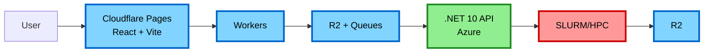

# Development Guide

This guide explains how to set up and run the accessible-pdf-rocky system locally.

## Architecture Layers

### Production (Full Stack)



### Local Development (Simplified)

```mermaid
flowchart LR
    A[User] --> B[React + Vite<br/>localhost:5173]
    B --> C[.NET 10 API<br/>localhost:5165]
    C --> D[D1 API Worker (db-api)<br/>localhost:8787]
    
    style B fill:#80d4ff,stroke:#0066cc,stroke-width:3px,color:#000
    style C fill:#90ee90,stroke:#228b22,stroke-width:3px,color:#000
    style D fill:#80d4ff,stroke:#0066cc,stroke-width:3px,color:#000
```

**Key differences (today):**

- Frontend talks directly to the .NET API (no Cloudflare Workers layer in front)
- The database runs locally via `wrangler dev` (D1 backed by SQLite)
- R2 + Queues + SLURM/HPC are part of the target architecture, but not wired into the end-to-end local workflow yet

## Quick Start

### Option 0: Dev Container (VS Code / Codespaces)

If you use VS Code or Codespaces, you can develop inside the repo's Dev Container for a consistent toolchain (Node, .NET, Python/uv).

See [.devcontainer/README.md](../.devcontainer/README.md).

### Option 1: Docker Compose (Recommended)

**Start everything:**

```bash
just dev
```

This starts:

- .NET 10 API server on port 5165
- React + Vite client on port 5173
- D1 API worker on port 8787

**Note:** All services run in Docker for consistent local development.

**Detached mode:**

```bash
just dev-up      # Start in background
just dev-logs    # View logs
just dev-down    # Stop everything
```

**Restart a service:**

```bash
just dev-restart client
just dev-restart server
```

### Option 2: Local Development (No Docker)

**Prerequisites:**

```bash
just setup  # Install all dependencies
```

**Start services in separate terminals:**

Terminal 1 - Client:

```bash
just dev-client
# or
cd client && npm run dev
```

Terminal 2 - Server:

```bash
just dev-server
# or
cd server && dotnet watch run
```

Terminal 3 - D1 API Worker:

```bash
cd workers/db-api
npm install
npm run db:migrate:local  # Apply schema to local D1
npm run dev  # Start on port 8787 with local D1
```

Terminal 4 - Metrics Ingest Worker (Optional):

```bash
cd workers/metrics-ingest
npm install
npm run db:migrate:local  # Apply schema to local D1
npx wrangler dev --port 8788  # Start on port 8788 to avoid conflict with db-api
```

**Note:** `wrangler dev` includes a local D1 SQLite instance automatically - no Docker needed! The local database is stored in `.wrangler/state/` and persists between runs. The metrics worker runs on port 8788 to avoid port conflict with db-api (port 8787).

## Environment Configuration

### Server (`server/.env`) (optional)

The server already has reasonable defaults for local development in `server/appsettings.Development.json`.

Create `server/.env` only if you want to override those defaults:

```bash
ASPNETCORE_ENVIRONMENT=Development
DB_API_URL=http://localhost:8787
DB_API_TOKEN=dev-token

# Optional metrics ingest worker
METRICS_ENDPOINT=http://localhost:8788/ingest
METRICS_TOKEN=dev-token
```

**Configuration:**

- `DB_API_URL` - Base URL for the Database API Worker (`workers/db-api`)
- `DB_API_TOKEN` - Auth token (must match the Worker's `DB_AUTH_TOKEN`)
- `METRICS_ENDPOINT` - Metrics ingest endpoint (optional)
- `METRICS_TOKEN` - Metrics ingest token (optional)

### Client (.env)

The client can be configured in two ways:

**Option 1: Use Vite proxy (recommended for development)**

No `client/.env` file needed. The Vite dev server proxies `/api/*` to the .NET server (see `client/vite.config.ts`).

- Locally (no Docker): the proxy target defaults to `http://localhost:5165`.
- In Docker: the proxy runs inside the container, so set `ASPNETCORE_URLS=http://server:5165` in the environment where Vite runs.

**Option 2: Direct API access**

Create `client/.env`:

```bash
VITE_API_URL=http://localhost:5165/api
```

**Notes:**

- The `/api` prefix is required because the .NET API routes are mounted at `/api/job/...`.
- When using Docker Compose, `http://server:5165` is not reachable from your browser (it's a Docker service name). Use `http://localhost:5165/api` instead.

## Testing Cloudflare Workers Locally

This repo contains multiple Workers packages:

- `workers/` - Edge API Worker (R2 + Queues; not part of the end-to-end local workflow yet)
- `workers/db-api/` - Database API Worker (D1) used by the .NET server
- `workers/metrics-ingest/` - Metrics ingest Worker (optional)

### Run the Edge API Worker

```bash
cd workers
npm install
npm run dev -- --port 8790
```

### Run the Database API Worker

```bash
cd workers/db-api
npm install
npm run db:migrate:local
npm run dev  # defaults to port 8787
```

If you see port conflicts, run one of the Workers on a different port (e.g. `--port 8790`).

## Database Setup

The project uses [Cloudflare D1](https://developers.cloudflare.com/d1/) for database storage via two Workers:

- `workers/db-api` - Main application database
- `workers/metrics-ingest` - Metrics collection database

### Local Development

Wrangler automatically creates a local D1 SQLite instance in `.wrangler/state/` when you run `npm run dev`. Apply schema migrations:

```bash
cd workers/db-api
npm run db:migrate:local  # Apply schema to local D1
```

For metrics:

```bash
cd workers/metrics-ingest
npm run db:migrate:local
```

### Remote (Production) Migrations

After updating `schema.sql`, apply to production (requires Cloudflare credentials):

```bash
cd workers/db-api
npm run db:migrate
```

For metrics:

```bash
cd workers/metrics-ingest
npm run db:migrate
```

### Reset Local Database

```bash
rm -rf workers/db-api/.wrangler/state/
rm -rf workers/metrics-ingest/.wrangler/state/
# Then re-run npm run db:migrate:local
```

## Development Workflow

### 1. Make Changes

Edit code in `client/`, `server/`, or `workers/`

### 2. Lint and Format

```bash
just lint
```

### 3. Run Tests

```bash
just test
```

### 4. CI Check

```bash
just ci  # Runs lint + test
```

### 5. View Logs

Docker:

```bash
just dev-logs
```

Local:

- Client: check the terminal running Vite
- Server: check the terminal running `dotnet watch`
- Workers: check the terminal running `wrangler dev`

## API Development

### Server Endpoints

.NET Web API provides Swagger UI:

- Swagger UI: <http://localhost:5165/swagger>

### Testing Endpoints

```bash
# Check status
curl http://localhost:5165/api/job/status/job-id-123
```

## Client Development

### Hot Reload

Vite automatically reloads on file changes.

### Component Development

```bash
cd client
npm run dev
```

Open <http://localhost:5173>

## Common Issues

### Port Conflicts

If ports are in use:

```bash
# Check what's using port 5173
lsof -i :5173

# Kill process
kill -9 <PID>
```

Or change ports in `docker-compose.yml`:

```yaml
ports:
  - "5174:5173"  # External:Internal
```

### Database Connection Errors

```bash
# Check if D1 API Worker is running
cd workers/db-api
npm run dev

# Test API connection
curl http://localhost:8787/jobs \
  -H "Authorization: Bearer dev-token"

# Check Worker logs in terminal
```

### Build Errors in .NET

```bash
# Restore dependencies
cd server
dotnet restore

# Or rebuild Docker image
just dev-down
just dev-up
```

### Node Module Issues

```bash
# Clear and reinstall
cd client
rm -rf node_modules package-lock.json
npm install

# Or rebuild Docker image
just dev-down
just dev-up
```

## Production vs Development

### Development Mode

- Hot reload enabled
- Debug logging
- Local Workers + local D1 (SQLite) via `wrangler dev`
- Uses development tokens (e.g. `dev-token`) for Worker/API authentication

### Production Mode

- Optimized builds
- Production logging
- Full authentication
- Real Cloudflare services
- R2 storage
- SLURM job scheduling

## Deployment

See [ARCHITECTURE.md](./ARCHITECTURE.md) for production deployment.

## Cloudflare Services (Local vs Planned)

Local development currently focuses on:

- The D1-backed Database API Worker (`workers/db-api`)
- The .NET API (`server/`) that talks to the Database API
- The React client (`client/`) that talks to the .NET API

The R2 + Queues parts of the target architecture exist under `workers/`, but are not wired into the end-to-end local workflow yet (the Upload UI is still stubbed).

See [ARCHITECTURE.md](./ARCHITECTURE.md) for the target production design.

## Tips

- Use `just help` to see all available commands
- Use `just dev` for full stack in one command
- Use individual `just dev-*` commands for targeted development
- Docker Compose is slower but more production-like
- Local development is faster but requires more setup
- Test locally, then deploy to Cloudflare preview before production

## Next Steps

1. Run `just setup`
2. Start the stack:
   - Docker: `just dev`
   - Local: `just dev-client` and `just dev-server` (and `workers/db-api`)
3. Open <http://localhost:5173/jobs>
4. Seed a job into the local database (so the UI has something to show):

```bash
JOB_ID="$(uuidgen)"

curl -X POST http://localhost:8787/jobs \
  -H 'Authorization: Bearer dev-token' \
  -H 'Content-Type: application/json' \
  -d "{\"id\":\"$JOB_ID\",\"r2_key\":\"local/example.pdf\",\"status\":\"submitted\"}"
```

1. Check API docs at <http://localhost:5165/swagger>
