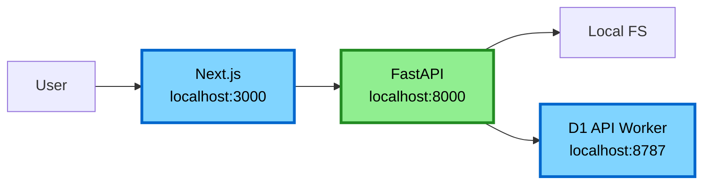

# Development Guide

This guide explains how to set up and run the accessible-pdf-rocky system locally.

## Architecture Layers

### Production (Full Stack)

```mermaid
flowchart LR
    A[User] --> B[Cloudflare Pages]
    B --> C[Workers]
    C --> D[R2 + Queues]
    D --> E[FastAPI]
    E --> F[SLURM/HPC]
    F --> G[R2]
    
    style B fill:#80d4ff,stroke:#0066cc,stroke-width:3px,color:#000
    style C fill:#80d4ff,stroke:#0066cc,stroke-width:3px,color:#000
    style D fill:#80d4ff,stroke:#0066cc,stroke-width:3px,color:#000
    style E fill:#90ee90,stroke:#228b22,stroke-width:3px,color:#000
    style F fill:#ff9999,stroke:#cc0000,stroke-width:3px,color:#000
    style G fill:#80d4ff,stroke:#0066cc,stroke-width:3px,color:#000
```



### Local Development (Simplified)



**Key differences:**

- Frontend talks directly to FastAPI (no Workers layer)
- Local filesystem instead of R2
- Direct processing instead of Cloudflare Queues
- No SLURM (runs ML locally or mocks it)

## Quick Start

### Option 1: Docker Compose (Recommended)

**Start everything:**

```bash
just dev
```

This starts:

- FastAPI controller on port 8000
- Next.js frontend on port 3000

**Note:** The D1 API worker is not included in docker-compose. You need to run it separately with `wrangler dev` (see Terminal 3 setup below). This is intentional - Wrangler's local dev server provides D1 emulation without Docker.

**Detached mode:**

```bash
just dev-up      # Start in background
just dev-logs    # View logs
just dev-down    # Stop everything
```

**Restart a service:**

```bash
just dev-restart frontend
just dev-restart controller
```

### Option 2: Local Development (No Docker)

**Prerequisites:**

```bash
just setup  # Install all dependencies
```

**Start services in separate terminals:**

Terminal 1 - Frontend:

```bash
just dev-frontend
# or
cd frontend && npm run dev
```

Terminal 2 - Controller:

```bash
just dev-controller
# or
cd controller && uv run uvicorn main:app --reload
```

Terminal 3 - D1 API Worker:

```bash
cd workers/db-api
npm install
npm run db:migrate:local  # Apply schema to local D1
npm run dev  # Start on port 8787 with local D1
```

**Note:** `wrangler dev` includes a local D1 SQLite instance automatically - no Docker needed! The local database is stored in `.wrangler/state/` and persists between runs.

## Environment Configuration

### Controller (.env)

Create `controller/.env`:

```bash
ENVIRONMENT=development
DB_API_URL=http://localhost:8787
DB_API_TOKEN=dev-token
STORAGE_MODE=local
STORAGE_PATH=./storage
QUEUE_MODE=direct

# Optional: Metrics collection
METRICS_ENDPOINT=http://localhost:8787/ingest
METRICS_TOKEN=dev-token
```

**Modes:**

- `STORAGE_MODE=local` - Use filesystem instead of R2
- `STORAGE_MODE=r2` - Use actual R2 (requires credentials)
- `QUEUE_MODE=direct` - Process jobs immediately
- `QUEUE_MODE=cloudflare` - Use Cloudflare Queues (requires credentials)

**Metrics (Optional):**

- `METRICS_ENDPOINT` - URL for push-based metrics collection (see [Metrics Deployment](METRICS_DEPLOYMENT.md))
- `METRICS_TOKEN` - Authentication token for metrics endpoint
- If not configured, metrics collection is silently disabled

### Frontend (.env.local)

Create `frontend/.env.local`:

```bash
NEXT_PUBLIC_API_URL=http://localhost:8000
```

## Testing Cloudflare Workers Locally

[Cloudflare Workers](https://developers.cloudflare.com/workers/) provides `wrangler dev` for local testing:

```bash
cd workers
npm run dev
# or
npx wrangler dev
```

This starts a local Workers runtime on port 8787.

**Note:** This still doesn't emulate:

- R2 (use Miniflare with local storage)
- Queues (use local queue implementation)
- Full edge behavior

For full Cloudflare testing, deploy to a preview environment.

## Database Setup

### Auto-migration (Docker Compose)

The controller automatically runs migrations on startup.

### Manual migration (Local)

```bash
cd controller
uv run alembic upgrade head
```

### Reset database

```bash
docker compose down -v  # Remove volumes
docker compose up       # Recreate
```

## Development Workflow

### 1. Make Changes

Edit code in `frontend/`, `controller/`, or `workers/`

### 2. Lint and Format

```bash
just lint
```

### 3. Run Tests

```bash
just test
```

### 4. CI Check

```bash
just ci  # Runs lint + test
```

### 5. View Logs

Docker:

```bash
just dev-logs
```

Local:

- Frontend: Check terminal
- Controller: Check terminal or `controller/logs/`

## API Development

### Controller Endpoints

[FastAPI](https://fastapi.tiangolo.com/) provides auto-generated docs:

- Swagger UI: <http://localhost:8000/docs>
- ReDoc: <http://localhost:8000/redoc>

### Testing Endpoints

```bash
# Upload PDF
curl -X POST http://localhost:8000/api/upload \
  -F "file=@test.pdf"

# Check status
curl http://localhost:8000/api/status/job-id-123
```

## Frontend Development

### Hot Reload

Next.js automatically reloads on file changes.

### Component Development

```bash
cd frontend
npm run dev
```

Open <http://localhost:3000>

## Common Issues

### Port Conflicts

If ports are in use:

```bash
# Check what's using port 3000
lsof -i :3000

# Kill process
kill -9 <PID>
```

Or change ports in `docker-compose.yml`:

```yaml
ports:
  - "3001:3000"  # External:Internal
```

### Database Connection Errors

```bash
# Check if D1 API Worker is running
cd workers/db-api
npm run dev

# Test API connection
curl http://localhost:8787/jobs \
  -H "Authorization: Bearer dev-token"

# Check Worker logs in terminal
```

### Import Errors in Python

```bash
# Resync dependencies
cd controller
uv sync

# Or rebuild Docker image
just dev-down
just dev-up
```

### Node Module Issues

```bash
# Clear and reinstall
cd frontend
rm -rf node_modules package-lock.json
npm install

# Or rebuild Docker image
just dev-down
just dev-up
```

## Production vs Development

### Development Mode

- Hot reload enabled
- Debug logging
- No authentication
- Mock services (Queue, R2)
- Local filesystem storage

### Production Mode

- Optimized builds
- Production logging
- Full authentication
- Real Cloudflare services
- R2 storage
- SLURM job scheduling

## Deployment

See [ARCHITECTURE.md](./ARCHITECTURE.md) for production deployment.

## Cloudflare Services Emulation

### R2 Storage

**Option 1: Local filesystem (current)**

```python
# controller uses local files
STORAGE_MODE=local
```

**Option 2: MinIO (S3-compatible)**

```yaml
# docker-compose.yml
services:
  minio:
    image: minio/minio
    ports:
      - "9000:9000"
    command: server /data
```

**Option 3: Use actual R2 (with test bucket)**

```bash
STORAGE_MODE=r2
R2_ACCOUNT_ID=your-account
R2_ACCESS_KEY_ID=your-key
R2_SECRET_ACCESS_KEY=your-secret
```

### Cloudflare Queues

**Option 1: Direct execution (current)**

```python
# Skip queue, call handler directly
QUEUE_MODE=direct
```

**Option 2: Redis queue**

```yaml
services:
  redis:
    image: redis:alpine
```

**Option 3: Use actual Cloudflare Queues (preview)**

```bash
wrangler queues create pdf-jobs --env preview
```

### [Cloudflare Workers](https://developers.cloudflare.com/workers/)

**Use `wrangler dev`:**

```bash
cd workers
npx wrangler dev
```

**Or deploy to preview:**

```bash
npx wrangler deploy --env preview
```

## Tips

- Use `just help` to see all available commands
- Use `just dev` for full stack in one command
- Use individual `just dev-*` commands for targeted development
- Docker Compose is slower but more production-like
- Local development is faster but requires more setup
- Test locally, then deploy to Cloudflare preview before production

## Next Steps

1. Set up `.env` files (see above)
2. Run `just dev` to start everything
3. Open <http://localhost:3000>
4. Upload a test PDF
5. Check API docs at <http://localhost:8000/docs>
