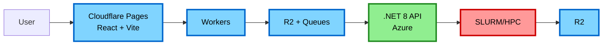
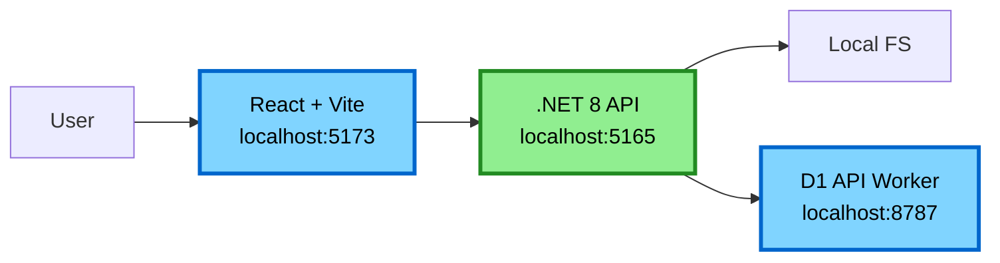

# Development Guide

This guide explains how to set up and run the accessible-pdf-rocky system locally.

## Architecture Layers

### Production (Full Stack)



### Local Development (Simplified)



**Key differences:**

- Frontend talks directly to .NET API (no Workers layer)
- Local filesystem instead of R2
- Direct processing instead of Cloudflare Queues
- No SLURM (runs ML locally or mocks it)

## Quick Start

### Option 1: Docker Compose (Recommended)

**Start everything:**

```bash
just dev
```

This starts:

- .NET 8 API server on port 5165
- React + Vite client on port 5173
- D1 API worker on port 8787

**Note:** All services run in Docker for consistent local development.

**Detached mode:**

```bash
just dev-up      # Start in background
just dev-logs    # View logs
just dev-down    # Stop everything
```

**Restart a service:**

```bash
just dev-restart client
just dev-restart server
```

### Option 2: Local Development (No Docker)

**Prerequisites:**

```bash
just setup  # Install all dependencies
```

**Start services in separate terminals:**

Terminal 1 - Client:

```bash
just dev-client
# or
cd client && npm run dev
```

Terminal 2 - Server:

```bash
just dev-server
# or
cd server && dotnet watch run
```

Terminal 3 - D1 API Worker:

```bash
cd workers/db-api
npm install
npm run db:migrate:local  # Apply schema to local D1
npm run dev  # Start on port 8787 with local D1
```

Terminal 4 - Metrics Ingest Worker (Optional):

```bash
cd workers/metrics-ingest
npm install
npm run db:migrate:local  # Apply schema to local D1
npx wrangler dev --port 8788  # Start on port 8788 to avoid conflict with db-api
```

**Note:** `wrangler dev` includes a local D1 SQLite instance automatically - no Docker needed! The local database is stored in `.wrangler/state/` and persists between runs. The metrics worker runs on port 8788 to avoid port conflict with db-api (port 8787).

## Environment Configuration

### Server (.env)

Create `server/.env`:

```bash
ASPNETCORE_ENVIRONMENT=Development
DatabaseApi__BaseUrl=http://localhost:8787
DatabaseApi__Token=dev-token
Metrics__Endpoint=http://localhost:8788/ingest
Metrics__Token=dev-token
```

**Configuration:**

- `DatabaseApi__BaseUrl` - URL for D1 API Worker
- `DatabaseApi__Token` - Authentication token for D1 API
- `Metrics__Endpoint` - URL for metrics collection (optional)
- `Metrics__Token` - Authentication token for metrics

### Client (.env)

The client can be configured in two ways:

**Option 1: Use Vite proxy (recommended for development)**

No `.env` file needed. Vite automatically proxies `/api/*` requests to the .NET server:

```typescript
// vite.config.ts already configured:
proxy: {
  '^/api': {
    target: 'http://localhost:5165',
  },
}
```

**Option 2: Direct API access**

Create `client/.env`:

```bash
VITE_API_URL=http://localhost:5165/api
```

**Note:** The `/api` prefix is required because the .NET API controller routes are mounted at `/api/job/...`. The client code defaults to `/api` if `VITE_API_URL` is not set, which works with the Vite proxy in development.

## Testing Cloudflare Workers Locally

[Cloudflare Workers](https://developers.cloudflare.com/workers/) provides `wrangler dev` for local testing:

```bash
cd workers
npm run dev
# or
npx wrangler dev
```

This starts a local Workers runtime on port 8787.

**Note:** This still doesn't emulate:

- R2 (use Miniflare with local storage)
- Queues (use local queue implementation)
- Full edge behavior

For full Cloudflare testing, deploy to a preview environment.

## Database Setup

The project uses [Cloudflare D1](https://developers.cloudflare.com/d1/) for database storage via two Workers:

- `workers/db-api` - Main application database
- `workers/metrics-ingest` - Metrics collection database

### Local Development

Wrangler automatically creates a local D1 SQLite instance in `.wrangler/state/` when you run `npm run dev`. Apply schema migrations:

```bash
cd workers/db-api
npm run db:migrate:local  # Apply schema to local D1
```

For metrics:

```bash
cd workers/metrics-ingest
npm run db:migrate:local
```

### Remote (Production) Migrations

After updating `schema.sql`, apply to production:

```bash
cd workers/db-api
npm run db:migrate:remote  # Requires Cloudflare credentials
```

### Reset Local Database

```bash
rm -rf workers/db-api/.wrangler/state/
rm -rf workers/metrics-ingest/.wrangler/state/
# Then re-run npm run db:migrate:local
```

## Development Workflow

### 1. Make Changes

Edit code in `client/`, `server/`, or `workers/`

### 2. Lint and Format

```bash
just lint
```

### 3. Run Tests

```bash
just test
```

### 4. CI Check

```bash
just ci  # Runs lint + test
```

### 5. View Logs

Docker:

```bash
just dev-logs
```

Local:

- Client: Check terminal
- Server: Check terminal or `server/logs/`

## API Development

### Server Endpoints

.NET Web API provides Swagger UI:

- Swagger UI: <http://localhost:5165/swagger>

### Testing Endpoints

```bash
# Check status
curl http://localhost:5165/api/job/status/job-id-123
```

## Client Development

### Hot Reload

Vite automatically reloads on file changes.

### Component Development

```bash
cd client
npm run dev
```

Open <http://localhost:5173>

## Common Issues

### Port Conflicts

If ports are in use:

```bash
# Check what's using port 5173
lsof -i :5173

# Kill process
kill -9 <PID>
```

Or change ports in `docker-compose.yml`:

```yaml
ports:
  - "5174:5173"  # External:Internal
```

### Database Connection Errors

```bash
# Check if D1 API Worker is running
cd workers/db-api
npm run dev

# Test API connection
curl http://localhost:8787/jobs \
  -H "Authorization: Bearer dev-token"

# Check Worker logs in terminal
```

### Build Errors in .NET

```bash
# Restore dependencies
cd server
dotnet restore

# Or rebuild Docker image
just dev-down
just dev-up
```

### Node Module Issues

```bash
# Clear and reinstall
cd client
rm -rf node_modules package-lock.json
npm install

# Or rebuild Docker image
just dev-down
just dev-up
```

## Production vs Development

### Development Mode

- Hot reload enabled
- Debug logging
- No authentication
- Mock services (Queue, R2)
- Local filesystem storage

### Production Mode

- Optimized builds
- Production logging
- Full authentication
- Real Cloudflare services
- R2 storage
- SLURM job scheduling

## Deployment

See [ARCHITECTURE.md](./ARCHITECTURE.md) for production deployment.

## Cloudflare Services Emulation

### R2 Storage

**Option 1: Local filesystem (current)**

```bash
# Server uses local files (configured in appsettings)
Storage__Mode=local
```

**Option 2: MinIO (S3-compatible)**

```yaml
# docker-compose.yml
services:
  minio:
    image: minio/minio
    ports:
      - "9000:9000"
    command: server /data
```

**Option 3: Use actual R2 (with test bucket)**

```bash
STORAGE_MODE=r2
R2_ACCOUNT_ID=your-account
R2_ACCESS_KEY_ID=your-key
R2_SECRET_ACCESS_KEY=your-secret
```

### Cloudflare Queues

**Option 2: Direct execution (current)**

```bash
# Skip queue, call handler directly
Queue__Mode=direct
```

**Option 2: Redis queue**

```yaml
services:
  redis:
    image: redis:alpine
```

**Option 3: Use actual Cloudflare Queues (preview)**

```bash
wrangler queues create pdf-jobs --env preview
```

### [Cloudflare Workers](https://developers.cloudflare.com/workers/)

**Use `wrangler dev`:**

```bash
cd workers
npx wrangler dev
```

**Or deploy to preview:**

```bash
npx wrangler deploy --env preview
```

## Tips

- Use `just help` to see all available commands
- Use `just dev` for full stack in one command
- Use individual `just dev-*` commands for targeted development
- Docker Compose is slower but more production-like
- Local development is faster but requires more setup
- Test locally, then deploy to Cloudflare preview before production

## Next Steps

1. Set up `.env` files (see above)
2. Run `just dev` to start everything
3. Open <http://localhost:5173>
4. Upload a test PDF
5. Check API docs at <http://localhost:5165/swagger>
