# Push-Based Metrics Deployment Guide

This guide covers deploying the push-based metrics system using Cloudflare Workers and D1.

## Architecture Overview

```mermaid
flowchart TD
    HPC["HPC SLURM Cluster<br/>(Cron / scheduled job)<br/>Push metrics"] -->|HTTPS POST<br/>/ingest| MetricsWorker

    Server[".NET API Server<br/>(optional push)"] -->|HTTPS POST<br/>/ingest| MetricsWorker

    MetricsWorker["Cloudflare Worker<br/>metrics-ingest<br/>• D1 storage<br/>• Token auth<br/>• /ingest, /metrics, /api/*"] --> D1

    D1["D1 Database<br/>metrics-db<br/>• retention via cron trigger"]

    MetricsWorker -->|Prometheus scrape<br/>/metrics| Monitoring

    Monitoring["Prometheus + Grafana<br/>• Scrapes /metrics<br/>• Dashboards & alerting"]

    style HPC fill:#ff9999,stroke:#cc0000,stroke-width:3px,color:#000
    style Server fill:#90ee90,stroke:#228b22,stroke-width:3px,color:#000
    style MetricsWorker fill:#80d4ff,stroke:#0066cc,stroke-width:3px,color:#000
    style D1 fill:#80d4ff,stroke:#0066cc,stroke-width:3px,color:#000
    style Monitoring fill:#ffeb99,stroke:#cc9900,stroke-width:3px,color:#000
```



**Key Benefits:**

- ✅ No inbound connections to HPC or .NET API server
- ✅ HPC only needs outbound HTTPS (firewall-friendly)
- ✅ Free tier (D1 + Workers)
- ✅ Secure (token-based authentication)
- ✅ Centralized metrics storage

## Prerequisites

- Node.js 18+ and npm
- Cloudflare account (free tier works)
- Wrangler CLI: `npm install -g wrangler`

## Step 1: Deploy Cloudflare Worker

### 1.1 Install Dependencies

```bash
cd workers/metrics-ingest
npm install
```

### 1.2 Create D1 Database

```bash
npm run db:create
```

This outputs something like:

```
✅ Successfully created DB 'metrics-db'!
📋 Database ID: abc123-def456-ghi789
```

Copy the `database_id` and update `wrangler.toml`:

```toml
[[d1_databases]]
binding = "METRICS_DB"
database_name = "metrics-db"
database_id = "abc123-def456-ghi789"  # Paste your ID here
```

### 1.3 Apply Database Schema

```bash
npm run db:migrate
```

### 1.4 Generate and Set Authentication Token

```bash
# Generate a secure random token
openssl rand -base64 32

# Set as secret in Cloudflare
npx wrangler secret put METRICS_AUTH_TOKEN
# Paste the generated token when prompted
```

**IMPORTANT:** Save this token securely - you'll need it for HPC and .NET API server configuration.

### 1.5 Deploy Worker

```bash
npm run deploy
```

Output:

```
✨ Published metrics-ingest (1.23s)
   https://metrics-ingest.<your-account>.workers.dev
```

### 1.6 Test the Worker

```bash
# Get the metrics endpoint (should return empty initially)
curl https://metrics-ingest.<your-account>.workers.dev/metrics

# Test ingestion (replace YOUR_TOKEN)
# Note: allowed sources are currently "hpc" and "server".
curl -X POST https://metrics-ingest.<your-account>.workers.dev/ingest \
  -H "Authorization: Bearer YOUR_TOKEN" \
  -H "Content-Type: application/json" \
  -d '{
    "source": "server",
    "timestamp": '$(date +%s)',
    "metrics": {
      "test_metric": 42
    }
  }'

# Verify it was stored
curl https://metrics-ingest.<your-account>.workers.dev/metrics
```

### 1.7 (Optional) Configure Custom Domain

```bash
# Add route in wrangler.toml
routes = [
  { pattern = "metrics.yourdomain.com/*", zone_name = "yourdomain.com" }
]

# Redeploy
npm run deploy
```

## Step 2: Configure HPC Metrics Push (optional)

This repository does not currently ship a SLURM-export script. On the cluster, create a small cron-driven script that POSTs JSON to the metrics worker.

### 2.1 Create an export script on the HPC login node

Create something like `/usr/local/bin/export_slurm_metrics.sh`:

```bash
#!/usr/bin/env bash
set -euo pipefail

: "${METRICS_ENDPOINT:?Set METRICS_ENDPOINT to https://metrics-ingest.<your-account>.workers.dev/ingest}"
: "${METRICS_TOKEN:?Set METRICS_TOKEN to your bearer token}"

pending_jobs=$(squeue -h -t PENDING | wc -l | tr -d ' ')
running_jobs=$(squeue -h -t RUNNING | wc -l | tr -d ' ')
now=$(date +%s)

curl -sS -X POST "$METRICS_ENDPOINT" \
  -H "Authorization: Bearer $METRICS_TOKEN" \
  -H "Content-Type: application/json" \
  -d "{\"source\":\"hpc\",\"timestamp\":$now,\"metrics\":{\"slurm_pending_jobs\":$pending_jobs,\"slurm_running_jobs\":$running_jobs}}" \
  >/dev/null
```

Then:

```bash
sudo chmod 755 /usr/local/bin/export_slurm_metrics.sh
```

### 2.2 Store the token securely

On the HPC login node:

```bash
echo "export METRICS_TOKEN='your-token-here'" > "$HOME/.metrics_token"
chmod 600 "$HOME/.metrics_token"
```

### 2.3 Add to cron

```bash
crontab -e

# Run every minute; source token from a protected file
* * * * * . "$HOME/.metrics_token" && METRICS_ENDPOINT="https://metrics-ingest.<your-account>.workers.dev/ingest" /usr/local/bin/export_slurm_metrics.sh >> "$HOME/slurm_metrics.log" 2>&1
```

### 2.4 Verify metrics are flowing

Wait 1-2 minutes, then:

```bash
# List sources seen in the last hour
curl https://metrics-ingest.<your-account>.workers.dev/api/sources
# Should include: ["hpc"] (and possibly "server" if you've tested it)

# Get recent HPC metrics
curl "https://metrics-ingest.<your-account>.workers.dev/api/metrics?source=hpc&window=5m"
```

## Step 3: Configure .NET API Server

### 3.1 Set Environment Variables

Set these values wherever the .NET server runs:

- `METRICS_ENDPOINT` = `https://metrics-ingest.<your-account>.workers.dev/ingest`
- `METRICS_TOKEN` = your bearer token

For Azure App Service (example):

```bash
az webapp config appsettings set \
  --name accessible-pdf-server \
  --resource-group your-rg \
  --settings \
    METRICS_ENDPOINT="https://metrics-ingest.<your-account>.workers.dev/ingest" \
    METRICS_TOKEN="your-token-here"
```

For local development (optional override):

```bash
# In server/.env
METRICS_ENDPOINT=https://metrics-ingest.<your-account>.workers.dev/ingest
METRICS_TOKEN=your-token-here
```

### 3.2 Verify Dependencies

The server includes a `MetricsClient` that can push metrics to the worker.

Important behavior:

- If `METRICS_TOKEN` is empty, pushes are skipped.
- The client sends `Authorization: Bearer <METRICS_TOKEN>` to `METRICS_ENDPOINT`.

The client is registered in `server/Program.cs`.

### 3.3 Test ingestion from the server environment

Even before wiring metrics into server code, you can validate outbound connectivity/token/auth by sending a test metric:

```bash
curl -X POST https://metrics-ingest.<your-account>.workers.dev/ingest \
  -H "Authorization: Bearer YOUR_TOKEN" \
  -H "Content-Type: application/json" \
  -d '{
    "source": "server",
    "timestamp": '$(date +%s)',
    "metrics": {
      "server_test_metric": 1
    }
  }'

curl "https://metrics-ingest.<your-account>.workers.dev/api/metrics?source=server&window=5m"
```

Note: the .NET server does not yet emit metrics automatically in this scaffold; you'll need to call the `MetricsClient` in the code paths you care about (job submission/status checks/etc.).

## Step 4: Configure Prometheus & Grafana

### 4.1 Update prometheus.yml

```yaml
global:
  scrape_interval: 30s

scrape_configs:
  - job_name: 'cloudflare-metrics'
    static_configs:
      - targets: ['metrics-ingest.<your-account>.workers.dev']
    scheme: https
    metrics_path: '/metrics'
    scrape_interval: 60s
```

### 4.2 Reload Prometheus

```bash
# Send SIGHUP to reload config
kill -HUP $(pidof prometheus)

# Or restart
systemctl restart prometheus
```

### 4.3 Verify in Prometheus

Visit `http://prometheus:9090/targets` and verify:

- Target is UP
- Last scrape successful

### 4.4 Query Metrics

In Prometheus query interface:

```promql
# See all metrics from HPC
{source="hpc"}

# Job queue depth
slurm_pending_jobs

# Submission latency
slurm_submission_latency_seconds
```

### 4.5 Grafana Dashboard

No Grafana dashboard JSON is checked into this repository yet.

Create a dashboard by querying the scraped metrics (for example, filter by `source="hpc"` / `source="server"`).

## Step 5: Monitoring & Maintenance

### 5.1 View Worker Logs

```bash
cd workers/metrics-ingest
npm run tail
```

### 5.2 Check Metrics Volume

```bash
# See which sources are active
curl https://metrics-ingest.<your-account>.workers.dev/api/sources

# Get metrics count (rough estimate)
cd workers/metrics-ingest
npm run db:query "SELECT COUNT(*) FROM metrics"
```

### 5.3 Data Retention / Cleanup

Data retention is implemented in the worker:

- A cron trigger runs daily (see `workers/metrics-ingest/wrangler.toml`).
- The worker's scheduled handler deletes rows older than `METRICS_RETENTION_DAYS` (default: 7).

To run cleanup manually (remote DB):

```bash
cd workers/metrics-ingest
npm run db:query "DELETE FROM metrics WHERE timestamp < strftime('%s', 'now', '-7 days')"
```

For local development DB:

```bash
cd workers/metrics-ingest
npm run db:query:local "DELETE FROM metrics WHERE timestamp < strftime('%s', 'now', '-7 days')"
```

### 5.4 Token Rotation

To rotate the authentication token:

```bash
# Generate new token
NEW_TOKEN=$(openssl rand -base64 32)

# Update Cloudflare secret
npx wrangler secret put METRICS_AUTH_TOKEN
# Paste new token

# Update HPC script (in ~/.metrics_token or crontab)
# Update .NET API server environment variables
# Both should continue working during rotation window
```

## Troubleshooting

### HPC metrics not appearing

```bash
# Check your cron/log output (example log path from this guide)
tail -n 200 "$HOME/slurm_metrics.log"

# Test manually
export METRICS_TOKEN='your-token'
export METRICS_ENDPOINT='https://metrics-ingest.<your-account>.workers.dev/ingest'
/usr/local/bin/export_slurm_metrics.sh

# Check if SLURM commands work
squeue -h | wc -l
```

### .NET API server metrics not appearing

1. Confirm `METRICS_ENDPOINT` and `METRICS_TOKEN` are set in the running environment.
2. Confirm your server code is actually calling the `MetricsClient` (it is present, but not wired into business logic in this scaffold).
3. Validate the worker is reachable from the server environment by running the curl test in step 3.3.

If you're on Azure App Service, you can inspect app settings via the portal, or:

```bash
az webapp config appsettings list \
  --name accessible-pdf-server \
  --resource-group your-rg
```

### Worker errors

```bash
# Check Worker logs
cd workers/metrics-ingest
npm run tail

# Check D1 database
cd workers/metrics-ingest
npm run db:query "SELECT * FROM metrics LIMIT 10"
```

### Prometheus not scraping

```bash
# Test endpoint manually
curl https://metrics-ingest.<your-account>.workers.dev/metrics

# Check Prometheus logs
journalctl -u prometheus -f

# Verify target in Prometheus UI
# http://prometheus:9090/targets
```

## Security Considerations

1. **Token Storage**
   - Never commit tokens to git
   - Use environment variables or secure vaults
   - Rotate tokens periodically (quarterly)

2. **Network Security**
   - Worker endpoint is public (by design for push-based)
   - Authentication required via Bearer token
   - Rate limiting automatic via Cloudflare

3. **Data Retention**
   - Keep 7 days max to stay in free tier
   - For longer retention, export to external storage

4. **Access Control**
   - Only HPC and .NET API server need write access (via token)
   - Prometheus has read-only access (public /metrics)
   - Consider adding IP allowlist if needed

## Cost Estimate

**Cloudflare (D1 + Workers)**

- Storage: 5GB free ≈ millions of metrics
- Reads: 5M/day free ≈ Prometheus scraping every 30s
- Writes: 100K/day free ≈ HPC (1/min) + .NET API server (1000/hr)
- **Expected Cost: $0/month**

**Prometheus/Grafana**

- Self-hosted: VM costs (~$20-50/month)
- Managed Grafana Cloud: Free tier available
- Azure Managed Grafana: ~$200/month

## Next Steps

1. Set up alerting rules in Prometheus (see docs/MONITORING_SETUP.md)
2. Create custom Grafana dashboards for your metrics
3. Add more metrics as needed in the .NET API server
4. Consider adding Azure metrics if deployed there

## References

- [Cloudflare D1 Documentation](https://developers.cloudflare.com/d1/)
- [Cloudflare Workers](https://developers.cloudflare.com/workers/)
- [Prometheus Documentation](https://prometheus.io/docs/)
