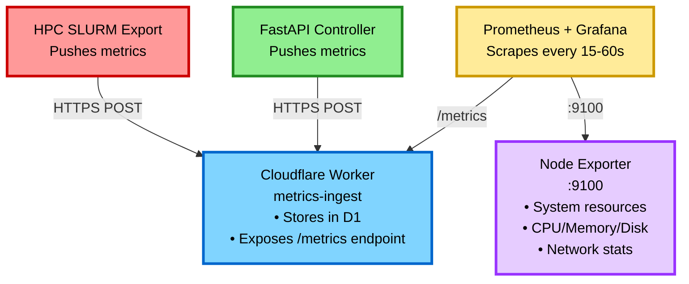

# Monitoring Setup Guide

This document describes the Prometheus observability stack for the accessible PDF system.

## Overview

We monitor three layers:

1. **FastAPI Controller** — Job submission, R2 URLs, queue depth
2. **HPC SLURM** — Job states, node availability, queue backlog
3. **Infrastructure** — System resources via Node Exporter

## Architecture



## FastAPI Controller Metrics

### Architecture Note

The FastAPI controller uses **push-based metrics** to a Cloudflare Worker instead of exposing a `/metrics` endpoint. This eliminates the need for inbound connections to the controller (important when behind HPC firewalls). See [Metrics Deployment](METRICS_DEPLOYMENT.md) for the full architecture.

### Available Metrics

| Metric | Type | Description |
|--------|------|-------------|
| `slurm_submitted_jobs_total` | Counter | Total jobs submitted |
| `slurm_submission_failures_total` | Counter | Failed submissions |
| `slurm_submission_latency_seconds` | Gauge | Time to submit job (latest value) |
| `slurm_pending_jobs` | Gauge | Jobs in PENDING state |
| `slurm_running_jobs` | Gauge | Jobs in RUNNING state |
| `slurm_completed_jobs` | Gauge | Jobs in COMPLETED state |
| `slurm_failed_jobs` | Gauge | Jobs in FAILED state |
| `slurm_job_duration_seconds` | Gauge | Time from submit to complete (latest value) |
| `slurm_status_check_seconds` | Gauge | Time to query job status (latest value) |
| `r2_presigned_url_generation_seconds` | Gauge | Time to generate URLs (latest value) |
| `cloudflare_queue_depth` | Gauge | Messages in Cloudflare Queue |

**Note**: Current implementation uses simple gauges for latency metrics. For histogram support with percentile calculations, the metrics-ingest worker would need to aggregate buckets. This could be added in the future if needed.

### Metrics Collection

Metrics are automatically pushed to the Cloudflare Worker endpoint when configured:

```bash
# In controller/.env
METRICS_ENDPOINT=https://metrics.your-domain.workers.dev/ingest
METRICS_TOKEN=your-secret-token
```

Prometheus scrapes metrics from the Worker's `/metrics` endpoint:

```bash
curl https://metrics.your-domain.workers.dev/metrics
```

See [Metrics Deployment](METRICS_DEPLOYMENT.md) for setup instructions.

## HPC SLURM Metrics

### Installation (on HPC login node)

```bash
# 1. Install SLURM metrics export script
sudo cp controller/hpc/scripts/export_slurm_metrics.sh /usr/local/bin/
sudo chmod 755 /usr/local/bin/export_slurm_metrics.sh
sudo chown root:root /usr/local/bin/export_slurm_metrics.sh

# 2. Configure metrics endpoint (secure location)
sudo mkdir -p /etc/slurm-metrics
sudo tee /etc/slurm-metrics/config <<EOF
export METRICS_ENDPOINT="https://metrics.your-domain.workers.dev/ingest"
export METRICS_TOKEN="your-secure-token-here"
EOF
sudo chmod 600 /etc/slurm-metrics/config

# 3. Add to crontab (run every minute)
sudo crontab -e
# Add line:
* * * * * source /etc/slurm-metrics/config && /usr/local/bin/export_slurm_metrics.sh
```

**Architecture Note**: Unlike traditional Node Exporter textfile collection, this uses push-based metrics to eliminate the need for inbound connections to the HPC cluster. The script pushes directly to the Cloudflare Worker.

### Available SLURM Metrics

| Metric | Type | Description |
|--------|------|-------------|
| `slurm_pending_jobs` | Gauge | Jobs waiting in queue |
| `slurm_running_jobs` | Gauge | Jobs currently running |
| `slurm_completed_jobs_1h` | Gauge | Completed in last hour |
| `slurm_failed_jobs_1h` | Gauge | Failed in last hour |
| `slurm_gpu_pending_jobs` | Gauge | GPU jobs waiting |
| `slurm_gpu_running_jobs` | Gauge | GPU jobs running |
| `slurm_nodes_idle` | Gauge | Idle compute nodes |
| `slurm_nodes_allocated` | Gauge | Allocated compute nodes |
| `slurm_nodes_down` | Gauge | Down/offline nodes |

### Test Metrics

```bash
# Test the export script manually
source /etc/slurm-metrics/config
/usr/local/bin/export_slurm_metrics.sh

# Verify metrics in Cloudflare Worker
curl https://metrics.your-domain.workers.dev/metrics | grep slurm_
```

## Prometheus Configuration

### Prometheus Setup

```bash
# On monitoring server
wget https://github.com/prometheus/prometheus/releases/download/v2.48.0/prometheus-2.48.0.linux-amd64.tar.gz
tar -xzf prometheus-*.tar.gz
sudo cp prometheus-*/prometheus /usr/local/bin/
sudo cp prometheus-*/promtool /usr/local/bin/
```

### prometheus.yml

```yaml
global:
  scrape_interval: 30s
  evaluation_interval: 30s

scrape_configs:
  # Cloudflare Worker (FastAPI + HPC metrics)
  - job_name: 'metrics-worker'
    static_configs:
      - targets: ['metrics.your-domain.workers.dev']
    metrics_path: '/metrics'
    scheme: https

  # Optional: Node Exporter on controller/HPC for system metrics
  - job_name: 'node'
    static_configs:
      - targets: ['fastapi.internal:9100', 'hpc-login.ucdavis.edu:9100']
```

### Start Prometheus

```bash
# Test configuration
promtool check config prometheus.yml

# Run Prometheus
prometheus --config.file=prometheus.yml --storage.tsdb.path=./data
```

Access Prometheus UI: `http://localhost:9090`

## Alerting Rules

Create `alerts.yml`:

```yaml
groups:
  - name: slurm_alerts
    interval: 1m
    rules:
      # High failure rate
      - alert: HighJobFailureRate
        expr: rate(slurm_submission_failures_total[5m]) > 0.1
        for: 5m
        labels:
          severity: warning
        annotations:
          summary: "High SLURM job failure rate"
          description: "More than 10% of jobs failing in last 5 minutes"

      # Long queue backlog
      - alert: LongQueueBacklog
        expr: slurm_pending_jobs > 100
        for: 10m
        labels:
          severity: warning
        annotations:
          summary: "Large number of pending jobs"
          description: "{{ $value }} jobs pending for >10 minutes"

      # All nodes down
      - alert: AllNodesDown
        expr: slurm_nodes_idle + slurm_nodes_allocated == 0
        for: 2m
        labels:
          severity: critical
        annotations:
          summary: "No SLURM nodes available"
          description: "All compute nodes are down"

      # Slow job submission
      - alert: SlowJobSubmission
        expr: slurm_submission_latency_seconds > 5
        for: 5m
        labels:
          severity: warning
        annotations:
          summary: "Slow job submission latency"
          description: "Job submission taking >5s (current: {{ $value }}s)"

      # Metrics worker down
      - alert: MetricsWorkerDown
        expr: up{job="metrics-worker"} == 0
        for: 1m
        labels:
          severity: critical
        annotations:
          summary: "Metrics collection is down"
          description: "Cloudflare Worker /metrics endpoint unreachable"
```

Load alerts:

```bash
prometheus --config.file=prometheus.yml \
  --storage.tsdb.path=./data \
  --web.enable-lifecycle
```

## Grafana Dashboards

### Grafana Setup

```bash
# Install Grafana
wget https://dl.grafana.com/oss/release/grafana-10.2.2.linux-amd64.tar.gz
tar -zxvf grafana-10.2.2.linux-amd64.tar.gz
cd grafana-10.2.2
./bin/grafana-server
```

Access Grafana: `http://localhost:3000` (admin/admin)

### Add Prometheus Data Source

1. Settings → Data Sources → Add data source
2. Select "Prometheus"
3. URL: `http://localhost:9090`
4. Save & Test

### Dashboard Panels

#### Panel 1: Job Submission Rate

```promql
rate(slurm_submitted_jobs_total[5m])
```

#### Panel 2: Job States

```promql
slurm_pending_jobs
slurm_running_jobs
slurm_completed_jobs
slurm_failed_jobs
```

#### Panel 3: Submission Latency (latest)

```promql
slurm_submission_latency_seconds
```

**Note**: For percentile calculations, you would need to implement histogram bucketing in the metrics-ingest worker.

#### Panel 4: Node Availability

```promql
slurm_nodes_idle
slurm_nodes_allocated
slurm_nodes_down
```

#### Panel 5: Failure Rate

```promql
rate(slurm_submission_failures_total[5m])
```

### Import Dashboard JSON

A complete dashboard JSON is available in `docs/grafana-dashboard.json`.

## Query Examples

### Jobs submitted in last hour

```promql
increase(slurm_submitted_jobs_total[1h])
```

### Current job duration

```promql
slurm_job_duration_seconds
```

**Note**: The current implementation provides the latest duration value. For average calculations over time, you would need to use `avg_over_time(slurm_job_duration_seconds[1h])`.

### Success rate

```promql
rate(slurm_submitted_jobs_total{status="success"}[5m]) / rate(slurm_submitted_jobs_total[5m])
```

### GPU utilization

```promql
slurm_gpu_running_jobs / (slurm_gpu_running_jobs + slurm_gpu_pending_jobs)
```

## Maintenance

### Log Rotation

Prometheus data grows over time. By default, Prometheus retains data for 15 days. To customize retention:

```bash
prometheus --storage.tsdb.retention.time=30d
```

### Backup Metrics

```bash
# Backup Prometheus data
tar czf prometheus-backup-$(date +%Y%m%d).tar.gz ./data
```

### Testing

```bash
# Check if metrics are being collected
curl -s http://localhost:9090/api/v1/query?query=up

# Test alert evaluation
promtool check rules alerts.yml
```

## Troubleshooting

### No metrics from FastAPI

```bash
# Check if /metrics endpoint works
curl http://fastapi.internal:8000/metrics

# Check Prometheus targets
curl http://localhost:9090/api/v1/targets | jq '.data.activeTargets'
```

### No SLURM metrics

```bash
# Check if script is running
sudo crontab -l | grep export_slurm_metrics

# Check if metrics file exists
ls -la /var/lib/node_exporter/textfile_collector/

# Test script manually
sudo /usr/local/bin/export_slurm_metrics.sh
```

### High cardinality warnings

If too many unique label combinations:

```promql
# Check series count
count({__name__=~".+"})

# Identify high-cardinality metrics
topk(10, count by (__name__)({__name__=~".+"}))
```

## Security

### Network Security

- Prometheus should not be exposed to the internet
- Use internal network or VPN
- Consider BasicAuth or OAuth proxy if needed

### Access Control

```yaml
# prometheus.yml
basic_auth:
  username: prometheus
  password: <bcrypt-hash>
```

## References

- [Prometheus Documentation](https://prometheus.io/docs/)
- [Node Exporter](https://github.com/prometheus/node_exporter)
- [Grafana Documentation](https://grafana.com/docs/)
- [PromQL Guide](https://prometheus.io/docs/prometheus/latest/querying/basics/)
