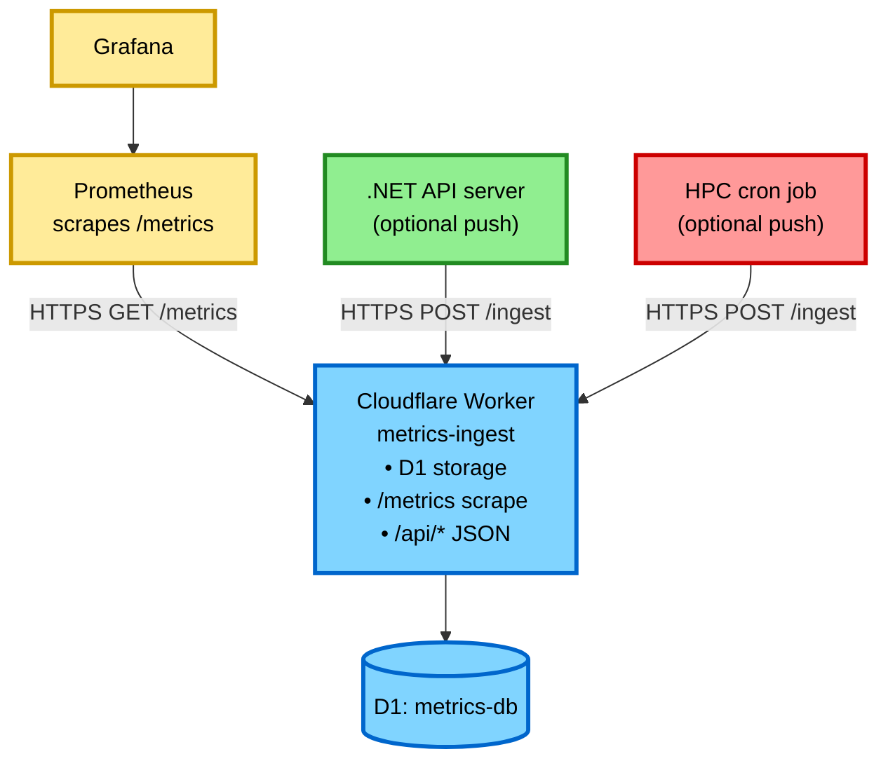

# Monitoring Setup Guide

This document describes how to monitor the **current** `accessible-pdf-rocky` repository.

## Overview (what exists today)

This repo ships the following monitoring-related components:

- **Metrics ingestion + scrape endpoint**: `workers/metrics-ingest/`
  - `POST /ingest` (token-authenticated)
  - `GET /metrics` (Prometheus scrape)
  - Stores samples in **Cloudflare D1**
- **Database API Worker**: `workers/db-api/`
  - `GET /health` (used by Docker health checks)
- **.NET API server**: `server/`
  - Health endpoints: `GET /health/live`, `GET /health/ready`, and `GET /health`

The repo also contains a `MetricsClient` in the .NET server, but it is **not wired into business logic yet**. See [Metrics Deployment](METRICS_DEPLOYMENT.md) for details.

## Architecture



## Metrics Ingest Worker (`workers/metrics-ingest`)

### Endpoints

- `POST /ingest`
  - Auth: `Authorization: Bearer <METRICS_AUTH_TOKEN>`
  - Payload: JSON with `source`, `timestamp` (seconds), and `metrics` (numeric)
  - Allowed `source` values (current implementation): `hpc`, `server`
- `GET /metrics`
  - Prometheus text format
- `GET /api/metrics` and `GET /api/sources`
  - Convenience endpoints for debugging

### Local development

Run the worker locally (use a non-default port to avoid conflicting with `workers/db-api`):

```bash
cd workers/metrics-ingest
npm install
npm run db:migrate:local
npm run dev -- --port 8788

# /metrics does not require auth
curl http://localhost:8788/metrics
```

## .NET API server (`server/`)

### Health endpoints

- Liveness: `GET http://localhost:5165/health/live`
- Readiness: `GET http://localhost:5165/health/ready`
- Legacy: `GET http://localhost:5165/health`

### Metrics push (optional)

The server includes `server/Services/MetricsClient.cs`, but the scaffold does not yet call it automatically.

If you wire it in, configure:

```bash
# server/.env
METRICS_ENDPOINT=https://metrics-ingest.<your-account>.workers.dev/ingest
METRICS_TOKEN=your-token-here
```

Metric keys currently used by `MetricsClient` when invoked:

- `slurm_submitted_jobs_total` (currently pushes `1` per submission event)
- `slurm_submission_latency_seconds`
- `slurm_submission_success` / `slurm_submission_failure`
- `slurm_submission_failure_<errorType>`
- `slurm_job_duration_seconds`
- `slurm_status_check_seconds`

## HPC / SLURM metrics (optional)

This repo does **not** include a SLURM export script. Create a cron-driven script that pushes a small set of numeric metrics to the worker.

Recommended pattern: also push a heartbeat metric like `hpc_heartbeat=1` once per minute, then alert on its absence.

See [Metrics Deployment](METRICS_DEPLOYMENT.md) for an example script.

## Prometheus configuration

Example `prometheus.yml` for scraping the hosted Worker:

```yaml
global:
  scrape_interval: 60s
  evaluation_interval: 60s

scrape_configs:
  - job_name: metrics-worker
    metrics_path: /metrics
    scheme: https
    static_configs:
      - targets:
          - metrics-ingest.<your-account>.workers.dev
```

To scrape a locally running worker instead:

```yaml
scrape_configs:
  - job_name: metrics-worker-local
    metrics_path: /metrics
    scheme: http
    static_configs:
      - targets:
          - localhost:8788
```

Optional: host-level system metrics via Node Exporter (not included in this repo):

```yaml
  - job_name: node
    static_configs:
      - targets:
          - server.internal:9100
          - hpc-login.internal:9100
```

## Alerting rules (examples)

These are templates; adjust thresholds and metric names to what you actually push.

```yaml
groups:
  - name: metrics
    interval: 1m
    rules:
      - alert: MetricsWorkerDown
        expr: up{job="metrics-worker"} == 0
        for: 2m
        labels:
          severity: critical
        annotations:
          summary: "Metrics worker scrape failed"

      # Recommended: push hpc_heartbeat=1 every minute from the HPC cron script.
      - alert: NoHpcHeartbeat
        expr: absent(hpc_heartbeat{source="hpc"})
        for: 15m
        labels:
          severity: warning
        annotations:
          summary: "No recent HPC metrics"
```

## Grafana dashboards

No dashboard JSON is checked into this repository currently.

Suggested panels:

- `slurm_pending_jobs{source="hpc"}` / `slurm_running_jobs{source="hpc"}`
- `slurm_submission_latency_seconds{source="server"}` (if you wire server push)
- `timestamp(hpc_heartbeat{source="hpc"})` (to see last push time)

## Troubleshooting

### Prometheus target is DOWN

```bash
# Hosted worker
curl -v https://metrics-ingest.<your-account>.workers.dev/metrics

# Local worker
curl -v http://localhost:8788/metrics
```

### No server metrics

1. Confirm `METRICS_ENDPOINT` and `METRICS_TOKEN` are set.
2. Confirm the server code path you expect is calling `MetricsClient`.
3. Validate ingestion directly:

```bash
curl -X POST https://metrics-ingest.<your-account>.workers.dev/ingest \
  -H "Authorization: Bearer YOUR_TOKEN" \
  -H "Content-Type: application/json" \
  -d '{"source":"server","timestamp":'$(date +%s)',"metrics":{"server_heartbeat":1}}'
```

### No HPC metrics

Check your cron output/logs and validate you are sending `source: "hpc"`.

## References

- [Metrics Deployment](METRICS_DEPLOYMENT.md)
- [Prometheus Documentation](https://prometheus.io/docs/)
- [Grafana Documentation](https://grafana.com/docs/)
