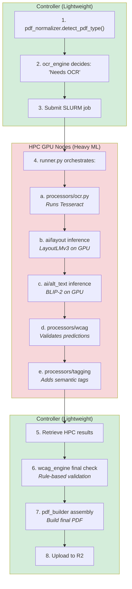

# System Design

This document describes the AI-powered PDF accessibility conversion pipeline, model selection, and processing architecture.

See [ARCHITECTURE.md](./ARCHITECTURE.md) for infrastructure and deployment details.

## Overview

The system converts arbitrary PDFs into WCAG 2.1/UA-compliant accessible PDFs through a multi-stage AI-powered pipeline:

1. **PDF Analysis** - Parse structure, detect type (digital/scanned/hybrid)
2. **AI Inference** - Layout detection, role classification, content understanding
3. **Accessibility Enhancement** - Alt-text generation, table structuring, reading order
4. **WCAG Enforcement** - Rule-based validation and repair
5. **PDF Reconstruction** - Build properly tagged accessible PDF

## Processing Pipeline

### Stage 1: PDF Ingestion & Classification


**Components:**

- PDF parser ([PyMuPDF](https://pymupdf.readthedocs.io/) or [pdfplumber](https://github.com/jsvine/pdfplumber))
- Type classifier (heuristic-based)
- OCR engine ([Tesseract](https://github.com/tesseract-ocr/tesseract), [PaddleOCR](https://github.com/PaddlePaddle/PaddleOCR), or Azure Vision)

### Stage 2: Layout & Structure Analysis


**Primary Model: [LayoutLMv3](https://huggingface.co/docs/transformers/model_doc/layoutlmv3) (Microsoft)**

- Vision + text + spatial understanding
- Designed for document structure
- Fine-tune for:
  - Heading hierarchy (H1/H2/H3/H4/H5/H6)
  - Role classification (paragraph, caption, footnote, header, footer)
  - Figure/table detection
  - Decorative element identification
  - List detection and nesting

**Alternative: [Donut](https://huggingface.co/docs/transformers/model_doc/donut) (Naver Clova)**

- OCR-free document understanding
- Good for forms and structured documents
- Use as inference module (no fine-tuning needed)

**Why Not [BERT](https://huggingface.co/docs/transformers/model_doc/bert)?**
[BERT](https://huggingface.co/docs/transformers/model_doc/bert) lacks spatial awareness—critical for understanding document layout and reading order.

### Stage 3: Reading Order Determination


**Approach:** Fine-tune LayoutLMv3 to predict reading order

**Training data format:**

```json
{
  "page_id": "doc1_p1",
  "elements": [
    {"id": "e1", "bbox": [x, y, w, h], "text": "...", "style": {...}},
    {"id": "e2", "bbox": [x, y, w, h], "text": "...", "style": {...}}
  ],
  "reading_order": ["e1", "e2", "e3", ...]
}
```

**Loss function:** Penalize incorrect sequencing and "jumps" (e.g., left column → right column → back to left)

### Stage 4: Content Understanding

#### A. Alt-Text Generation


**Best Models:**

- **[BLIP-2](https://huggingface.co/docs/transformers/model_doc/blip-2)** - Strong captioning, factual descriptions
- **[LLaVA](https://github.com/haotian-liu/LLaVA)-1.6** - High-quality vision understanding
- **[MiniGPT-5](https://github.com/eric-ai-lab/MiniGPT-5)** - Efficient, accurate captions

**Fine-tuning strategy:**

```python
# Training pairs
{
  "image": figure_image,
  "caption": "Bar chart showing revenue growth from 2020 to 2024",
  "negative": "A colorful chart with bars"  # penalize vague descriptions
}
```

**Fine-tune on:**

- Charts (line, bar, scatter, pie)
- Scientific diagrams
- UI screenshots
- Educational materials
- Figure + caption pairs from academic papers

**Training objective:** Minimize hallucination, maximize factual accuracy

#### B. Table Structure Recognition


**Vision-based approaches:**

- [TableNet](https://github.com/asagar60/TableNet-pytorch)
- [CascadeTabNet](https://github.com/DevashishPrasad/CascadeTabNet)

**Transformer-based approaches:**

- **[TAPAS](https://huggingface.co/docs/transformers/model_doc/tapas) (Google)** - Table parsing to JSON
- **[TaBERT](https://github.com/facebookresearch/TaBERT) (Facebook)** - Table understanding

**Fine-tuning data:**

```json
{
  "table_image": "...",
  "structure": {
    "headers": ["Year", "Revenue", "Profit"],
    "rows": [
      ["2020", "$100M", "$20M"],
      ["2021", "$150M", "$35M"]
    ],
    "header_scope": "col"
  }
}
```

### Stage 5: WCAG Rule Enforcement


**Deterministic rules:**

- Heading hierarchy validation (no skipped levels)
- List structure enforcement (proper nesting)
- Language attribute on document
- Title metadata
- Alt-text presence on all images
- Table headers (TH vs TD)
- Proper semantic tags
- Color contrast validation (if applicable)

**Implementation:**

```python
# controller/services/wcag_engine.py
class WCAGValidator:
    def validate_heading_hierarchy(self, elements):
        """Ensure no skipped heading levels (H1 → H3 invalid)"""
        pass
    
    def enforce_list_structure(self, elements):
        """Wrap list items in proper <ul>/<ol> tags"""
        pass
    
    def validate_alt_text(self, images):
        """Check all images have alt text or marked decorative"""
        pass
    
    def build_structure_tree(self, elements):
        """Create proper tagged PDF structure tree"""
        pass
```

### Stage 6: Accessible PDF Construction


**Tools:**

- **[PyMuPDF](https://pymupdf.readthedocs.io/)** - PDF manipulation
- **[iText](https://itextpdf.com/) (Java)** - Commercial-grade PDF tagging
- **[pdfplumber](https://github.com/jsvine/pdfplumber)** - Text extraction for verification

**Output includes:**

- Structure tree with proper tags
- Alt-text embedded in PDF
- Reading order metadata
- Language specification
- Document title and metadata
- Logical structure markers

## AI Model Selection Matrix

| Task | Best Model | Fine-Tune? | Priority |
|------|-----------|------------|----------|
| Layout parsing | [LayoutLMv3](https://huggingface.co/docs/transformers/model_doc/layoutlmv3), [Donut](https://huggingface.co/docs/transformers/model_doc/donut) | Yes | Critical |
| Reading order | [LayoutLMv3](https://huggingface.co/docs/transformers/model_doc/layoutlmv3) | Yes | Critical |
| Alt-text generation | [BLIP-2](https://huggingface.co/docs/transformers/model_doc/blip-2), [LLaVA](https://github.com/haotian-liu/LLaVA) | Yes | High |
| Table structure | [TAPAS](https://huggingface.co/docs/transformers/model_doc/tapas), [TaBERT](https://github.com/facebookresearch/TaBERT) | Yes | High |
| OCR | [Tesseract](https://github.com/tesseract-ocr/tesseract), Google Vision | No | Medium |
| Page understanding | GPT-4 Vision, [Donut](https://huggingface.co/docs/transformers/model_doc/donut) | No | Low |

## Fine-Tuning Priorities

### 1. Heading Classification & Hierarchy (Critical)

**Model:** [LayoutLMv3](https://huggingface.co/docs/transformers/model_doc/layoutlmv3)

**Input:** Text + bounding box + style features (font size, weight, indentation)

**Output:** Role classification (H1/H2/H3/H4/H5/H6, body, caption, footnote, list item)

**Dataset:** 10K+ labeled document pages with annotated heading levels

### 2. Reading Order Prediction (Critical)

**Model:** [LayoutLMv3](https://huggingface.co/docs/transformers/model_doc/layoutlmv3) fine-tuned for sequence prediction

**Input:** Set of document elements with positions

**Output:** Ordered sequence of element IDs

**Loss:** Sequence loss with penalty for incorrect jumps (multi-column handling)

### 3. Alt-Text Generation (High Priority)

**Model:** [BLIP-2](https://huggingface.co/docs/transformers/model_doc/blip-2) or [LLaVA](https://github.com/haotian-liu/LLaVA)

**Training set:**

- 50K+ chart images with objective descriptions
- Scientific diagrams with captions
- UI elements with functional descriptions
- Negative examples to penalize hallucination

**Validation:** Human evaluation + ROUGE/BLEU against expert descriptions

### 4. Table Structure Recognition (High Priority)

**Model:** [TAPAS](https://huggingface.co/docs/transformers/model_doc/tapas)

**Training set:**

- PDF tables → HTML/JSON conversions
- 20K+ tables with header/data cell annotations
- Complex tables (merged cells, multi-level headers)

**Output format:** Structured JSON with semantic roles

## Backend Service Architecture

### Two-Layer Orchestration

**Layer 1: Controller (Cloudflare ↔ HPC ↔ [R2](https://developers.cloudflare.com/r2/) Flow)**

The `controller/services/` layer orchestrates job flow between components:

- Pulls jobs from [Cloudflare Queue](https://developers.cloudflare.com/queues/)
- Downloads PDFs from [R2](https://developers.cloudflare.com/r2/)
- Submits [SLURM](https://slurm.schedmd.com/) jobs to HPC
- Monitors job status
- Retrieves results
- Uploads to [R2](https://developers.cloudflare.com/r2/)
- Updates database

**Layer 2: HPC Runner (ML Pipeline on GPU)**

The `hpc_runner/` layer orchestrates heavy ML processing:

- Loads GPU models ([LayoutLMv3](https://huggingface.co/docs/transformers/model_doc/layoutlmv3), [BLIP-2](https://huggingface.co/docs/transformers/model_doc/blip-2), [TAPAS](https://huggingface.co/docs/transformers/model_doc/tapas))
- Runs layout detection
- Generates alt-text
- Parses tables
- Outputs results

### [FastAPI](https://fastapi.tiangolo.com/) Job Pipeline (Controller)

```python
# controller/services/job_runner.py
async def process_pdf_job(job_id: str, pdf_path: Path) -> tuple[Path, dict]:
    """Orchestrate Cloudflare ↔ HPC ↔ R2 flow"""
    
    # 1. Download PDF from R2
    pdf_path = await download_pdf_from_r2(job_id)
    
    # 2. Classify & preprocess locally
    pdf_type = detect_pdf_type(pdf_path)
    
    # 3. Submit to HPC for heavy ML processing
    slurm_id = submit_slurm_job(job_id, pdf_path)
    
    # 4. Monitor HPC job
    await monitor_slurm_job(slurm_id)
    
    # 5. Retrieve results from HPC
    hpc_results = await retrieve_hpc_results(job_id)
    
    # 6. Local WCAG validation & repair
    validated = wcag_engine.validate_and_repair(
        hpc_results["layout"],
        hpc_results["reading_order"],
        hpc_results["alt_texts"],
        hpc_results["tables"]
    )
    
    # 7. Build accessible PDF locally
    output_pdf = build_tagged_pdf(validated, pdf_path)
    
    # 8. Upload to R2
    await upload_to_r2(output_pdf, job_id)
    
    # 9. Generate report
    report = generate_compliance_report(validated)
    
    return output_pdf, report
```

### HPC ML Pipeline (GPU Processing)

```python
# hpc_runner/runner.py
def analyze_pdf(pdf_path: str, job_id: str) -> dict:
    """Heavy ML processing on GPU nodes"""
    
    # 1. Layout detection (LayoutLMv3)
    from ai.layout.inference import run_layout_inference
    layout = await run_layout_inference(pdf_path)
    
    # 2. Reading order prediction
    reading_order = predict_reading_order(layout)
    
    # 3. Alt-text generation (BLIP-2/LLaVA)
    from ai.alt_text.inference import generate_alt_texts
    figures = extract_figures(layout)
    alt_texts = await generate_alt_texts(figures)
    
    # 4. Table parsing (TAPAS)
    from ai.tables.inference import parse_tables
    tables = extract_tables(layout)
    table_data = await parse_tables(tables)
    
    return {
        "layout": layout,
        "reading_order": reading_order,
        "alt_texts": alt_texts,
        "tables": table_data
    }
```

### Service Layer Organization (Controller)

Runs on [FastAPI](https://fastapi.tiangolo.com/) controller, orchestrates Cloudflare ↔ HPC ↔ [R2](https://developers.cloudflare.com/r2/):

```
controller/services/
├── pdf_parser.py          # [PyMuPDF](https://pymupdf.readthedocs.io/)/[pdfplumber](https://github.com/jsvine/pdfplumber) extraction (lightweight)
├── pdf_normalizer.py      # Type detection, preprocessing
├── ocr_engine.py          # OCR orchestration (may delegate to HPC)
├── wcag_engine.py         # Rule-based validation
├── pdf_builder.py         # Tagged PDF construction
└── job_runner.py          # Main orchestration (Cloudflare ↔ HPC flow)
```

### AI Inference Layer (HPC GPU Nodes)

Runs on HPC GPU nodes via [SLURM](https://slurm.schedmd.com/), performs heavy ML:

```
hpc_runner/
├── runner.py              # Main SLURM entry point (orchestrates ML pipeline)
├── ai/                    # Low-level ML model wrappers
│   ├── layout/
│   │   ├── model.py       # LayoutLMv3 wrapper
│   │   └── inference.py   # Batch inference
│   ├── alt_text/
│   │   ├── model.py       # BLIP-2/LLaVA wrapper
│   │   └── inference.py   # Image captioning
│   └── tables/
│       ├── model.py       # TAPAS wrapper
│       └── inference.py   # Table parsing
└── processors/            # High-level business logic
    ├── layout.py          # Calls ai/layout, adds WCAG validation
    ├── alttext.py         # Calls ai/alt_text, ensures compliance
    ├── ocr.py             # OCR orchestration (external tools)
    ├── wcag.py            # Rule-based validation
    └── tagging.py         # PDF manipulation
```

**Key Distinction:**

- `controller/services/` = Lightweight orchestration, no heavy ML
- `hpc_runner/` = Heavy GPU-based ML processing

#### HPC Runner Internal Architecture: ai/ vs processors/

The `hpc_runner/` has a two-layer architecture to separate ML concerns from business logic:

**Layer 1: `ai/` - ML Model Layer (Low-Level)**

Direct wrappers around heavy ML models. This is the closest to the metal:

- **Purpose:** Load models, run inference, return raw predictions
- **Responsibilities:**
  - Model loading ([LayoutLMv3](https://huggingface.co/docs/transformers/model_doc/layoutlmv3), [BLIP-2](https://huggingface.co/docs/transformers/model_doc/blip-2), [TAPAS](https://huggingface.co/docs/transformers/model_doc/tapas))
  - GPU memory management
  - Forward passes
  - Batch processing optimization
  - Return raw model outputs (tensors, logits, predictions)

- **Example:**

  ```python
  # ai/layout/model.py
  class LayoutModel:
      def predict_structure(self, pdf_page):
          # Load LayoutLMv3
          # Run inference
          # Return raw predictions (bboxes, labels, confidences)
  
  # ai/layout/inference.py
  async def run_layout_inference(pdf_path):
      model = LayoutModel()
      # Batch all pages, run inference, return raw results
  ```

**Layer 2: `processors/` - Business Logic Layer (High-Level)**

Application logic that **uses** the AI models to accomplish tasks:

- **Purpose:** Add business logic, validation, WCAG compliance
- **Responsibilities:**
  - Call `ai/` layer for ML predictions
  - Validate predictions
  - Apply WCAG-specific rules
  - Clean up and structure results
  - Return application-ready outputs

- **Example:**

  ```python
  # processors/layout.py
  from ai.layout.inference import run_layout_inference
  
  def detect_layout(pdf_path):
      # 1. Get raw ML predictions
      raw_layout = await run_layout_inference(pdf_path)
      
      # 2. Add business logic
      validated = validate_predictions(raw_layout)
      heading_hierarchy = check_heading_hierarchy(validated)
      
      # 3. Add WCAG metadata
      wcag_compliant = add_wcag_metadata(heading_hierarchy)
      
      # 4. Return application-ready structure
      return wcag_compliant
  ```

**Which processors use ai/?**

| Processor | Uses ai/ layer? | Notes |
|-----------|----------------|-------|
| `processors/layout.py` | ✅ Yes | Calls `ai/layout/` for [LayoutLMv3](https://huggingface.co/docs/transformers/model_doc/layoutlmv3) predictions |
| `processors/alttext.py` | ✅ Yes | Calls `ai/alt_text/` for [BLIP-2](https://huggingface.co/docs/transformers/model_doc/blip-2)/[LLaVA](https://github.com/haotian-liu/LLaVA) captions |
| `processors/ocr.py` | ❌ No | Calls external OCR engines ([Tesseract](https://github.com/tesseract-ocr/tesseract), [PaddleOCR](https://github.com/PaddlePaddle/PaddleOCR)) |
| `processors/wcag.py` | ❌ No | Rule-based validation, no ML |
| `processors/tagging.py` | ❌ No | PDF manipulation with [PyMuPDF](https://pymupdf.readthedocs.io/)/[iText](https://itextpdf.com/) |

**Flow in runner.py:**

```python
# hpc_runner/runner.py
def analyze_pdf(pdf_path, job_id):
    # Step 1: Get raw ML predictions from ai/ layer
    from ai.layout.inference import run_layout_inference
    from ai.alt_text.inference import generate_alt_texts
    from ai.tables.inference import parse_tables
    
    raw_layout = await run_layout_inference(pdf_path)
    raw_alt_texts = await generate_alt_texts(figures)
    raw_tables = await parse_tables(tables)
    
    # Step 2: Process with business logic via processors/
    from processors.layout import analyze_reading_order
    from processors.wcag import check_wcag_compliance
    
    validated_layout = analyze_reading_order(raw_layout)
    wcag_issues = check_wcag_compliance(validated_layout)
    
    # Step 3: Return application-ready results
    return {
        "layout": validated_layout,
        "alt_texts": raw_alt_texts,  # Already validated by processors/alttext
        "tables": raw_tables,
        "wcag_issues": wcag_issues,
    }
```

This separation keeps ML model concerns separate from business logic and makes the codebase more maintainable.

### Addressing Naming Overlap: controller/services vs hpc_runner

**Important:** You'll notice similar file names in `controller/services/` and `hpc_runner/` (e.g., `ocr_engine.py`, `wcag.py`). This overlap is **intentional** and serves different purposes:

#### Runtime Environments

| Layer | Where | Resources | Purpose |
|-------|-------|-----------|----------|
| `controller/services/` | FastAPI server (VM) | CPU only, lightweight | Orchestrate Cloudflare ↔ HPC ↔ R2 flow |
| `hpc_runner/` | HPC GPU nodes | A100/H100 GPUs, 10s GB RAM | Heavy ML processing |

#### Why Similar Names?

These layers handle the **same domain** (OCR, WCAG, PDF) but at **different stages** with **different responsibilities**:

**Pattern:** Controller decides/coordinates → HPC executes heavy work → Controller validates/assembles

#### Detailed Overlap Explanation

**1. OCR Processing**

`controller/services/ocr_engine.py`:

- Analyzes PDF type: "Is this scanned?"
- Decides: "Should we run OCR? Which engine?"
- Orchestrates: "Submit to HPC for OCR" or "Skip OCR"
- Lightweight logic, no actual OCR

`hpc_runner/processors/ocr.py`:

- Actually runs Tesseract/PaddleOCR on GPU
- Heavy image processing
- Returns extracted text

**2. WCAG Validation**

`controller/services/wcag_engine.py`:

- Final validation after HPC returns
- "Are all requirements met?"
- Rule-based checks on completed results
- Builds final compliance report

`hpc_runner/processors/wcag.py`:

- Validates during ML processing
- "Does this layout meet WCAG?"
- Checks ML predictions against rules
- Real-time validation as processing happens

**3. PDF Operations**

`controller/services/pdf_builder.py`:

- Assembles final accessible PDF
- Takes validated results and builds output
- Adds final metadata
- Lightweight PDF assembly

`hpc_runner/processors/tagging.py`:

- Adds semantic tags during processing
- Tags headings, paragraphs, figures
- Structure annotations for accessibility
- Heavy PDF manipulation with PyMuPDF

#### Complete Processing Flow



**Summary:** Same domain, different stages. Controller coordinates and makes decisions. HPC does the heavy lifting. Controller validates and assembles the final output.

## Frontend Features

### Authentication

- **Required:** UC Davis campus account login via EntraID (Microsoft Azure AD)
- All features require authenticated session

### Pages

- `/` - Landing page (login redirect if unauthenticated)
- `/upload` - PDF upload with drag-and-drop
- `/documents/[id]` - Document dashboard
- `/documents/[id]/review` - Accessibility review editor
- `/reports/[id]` - Compliance report viewer

### Key Components

#### 1. PDF Preview with Structure Overlay

```typescript
// components/PDFViewer.tsx
- React-pdf renderer
- Structure tree visualization
- Element highlighting on hover
- Bounding box overlays
```

#### 2. Structure Tree Inspector

```typescript
// components/StructureTree.tsx
- Hierarchical tag view
- Drag-to-reorder functionality
- Tag type editor
- Reading order visualization
```

#### 3. Alt-Text Editor

```typescript
// components/AltTextEditor.tsx
- AI-generated suggestions
- Manual override
- Mark as decorative
- Context preview
```

#### 4. Reading Order Editor

```typescript
// components/ReadingOrderEditor.tsx
- Visual element sequence
- Drag-and-drop reordering
- Multi-column flow visualization
- Validation warnings
```

#### 5. WCAG Error List

```typescript
// components/WCAGErrors.tsx
- Categorized by severity (A, AA, AAA)
- Click to navigate to issue
- Auto-fix suggestions
- Export compliance report
```

## Database Schema

### Jobs Table

```sql
CREATE TABLE jobs (
    id UUID PRIMARY KEY,
    user_id UUID REFERENCES users(id),
    status VARCHAR(50),  -- pending, processing, completed, failed
    pdf_key VARCHAR(255),
    output_key VARCHAR(255),
    created_at TIMESTAMP,
    started_at TIMESTAMP,
    completed_at TIMESTAMP,
    error_message TEXT
);
```

### Documents Table

```sql
CREATE TABLE documents (
    id UUID PRIMARY KEY,
    job_id UUID REFERENCES jobs(id),
    title VARCHAR(255),
    page_count INTEGER,
    pdf_type VARCHAR(50),  -- digital, scanned, hybrid
    language VARCHAR(10),
    created_at TIMESTAMP
);
```

### Elements Table

```sql
CREATE TABLE elements (
    id UUID PRIMARY KEY,
    document_id UUID REFERENCES documents(id),
    page_number INTEGER,
    element_type VARCHAR(50),  -- heading, paragraph, figure, table, list
    bbox JSONB,  -- {x, y, width, height}
    text TEXT,
    reading_order INTEGER,
    ai_confidence FLOAT,
    human_override BOOLEAN,
    created_at TIMESTAMP
);
```

### Alt-Texts Table

```sql
CREATE TABLE alt_texts (
    id UUID PRIMARY KEY,
    element_id UUID REFERENCES elements(id),
    alt_text TEXT,
    ai_generated TEXT,
    human_edited BOOLEAN,
    is_decorative BOOLEAN,
    created_at TIMESTAMP,
    updated_at TIMESTAMP
);
```

## Storage Strategy

### Object Storage (R2/S3)

```
/uploads/{job_id}/original.pdf      # Original upload
/processing/{job_id}/ocr.json       # OCR results
/processing/{job_id}/layout.json    # Layout analysis
/processing/{job_id}/figures/*.png  # Extracted figures
/outputs/{job_id}/accessible.pdf    # Final output
/reports/{job_id}/compliance.json   # WCAG report
```

### Optional Box Integration

**Future Feature:** Automatic upload of results to user's Box folder

- OAuth integration with Box API
- User grants permission to write to their Box account
- Results automatically saved to `/Accessible PDFs/{job_id}/`
- User maintains full control via Box sharing and permissions
- Falls back to R2 download if Box integration not enabled

## Model Training Pipeline

### 1. Dataset Preparation

```bash
# scripts/prepare_training_data.py
python scripts/prepare_training_data.py \
  --task layout \
  --input-dir data/raw \
  --output-dir data/processed/layout \
  --format layoutlmv3
```

### 2. Model Fine-Tuning

```bash
# scripts/train_layout.py
python scripts/train_layout.py \
  --model microsoft/layoutlmv3-base \
  --train-data data/processed/layout/train.json \
  --val-data data/processed/layout/val.json \
  --epochs 10 \
  --batch-size 16 \
  --output models/layout-ft
```

### 3. Model Evaluation

```bash
# scripts/benchmark.py
python scripts/benchmark.py \
  --model models/layout-ft \
  --test-data data/processed/layout/test.json \
  --metrics accuracy,f1,precision,recall
```

## Performance Targets

| Metric | Target | Notes |
|--------|--------|-------|
| Job processing time | < 2 min per page | On GPU worker |
| Layout accuracy | > 95% | F1 score on test set |
| Alt-text quality | > 4.0/5.0 | Human evaluation |
| Reading order accuracy | > 98% | Correct sequence |
| WCAG compliance | 100% | AA level minimum |
| API response time | < 100ms | Status checks |

## Security & Privacy

- **Authentication** - UC Davis campus account required (EntraID/Azure AD integration)
- **Authorization** - Users can only access their own jobs and results
- **PDF sanitization** - Remove embedded scripts, forms, JavaScript
- **Content isolation** - Each job in separate container
- **PII detection** - Flag sensitive content (SSN, credit cards)
- **Access control** - Signed URLs with expiration
- **Audit logging** - All AI decisions logged for review
- **Box integration** - Optional, user-controlled OAuth with write permissions

## Future Enhancements

### Phase 2

- Math equation accessibility (MathML)
- Multi-language support
- Batch processing API
- Webhooks for job completion

### Phase 3

- Human-in-the-loop review workflow
- Active learning from corrections
- Custom model fine-tuning per organization
- PDF form accessibility

### Phase 4

- Real-time collaborative editing
- Browser extension for instant checking
- PowerPoint/Word conversion support
- Mobile app for on-device processing
